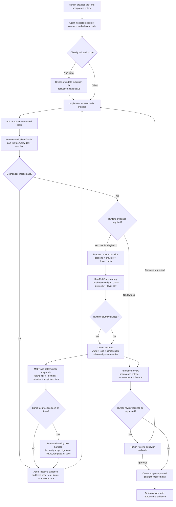
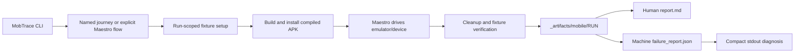

# Full Agent Harness Loop

Status: WIP

This diagram describes the current local, evidence-driven development loop in
`mobile-core-kit`. It connects human task intake, agent execution planning,
implementation, mechanical verification, compiled-app runtime evidence,
failure diagnosis, review, and harness improvement.

## End-To-End Loop

## Mechanical Verification Gate

`dart run tool/verify.dart --env dev` currently orchestrates:

```mermaid
flowchart LR
    V0[verify.dart]
    V1[Dependency resolution]
    V2[Environment schema and generated config]
    V3[Localization generation and checks]
    V4[Project-map drift]
    V5[Flutter analyze]
    V6[Custom lints]
    V7[Core and small-helper duplication checks]
    V8[Modal and hardcoded-color guardrails]
    V9[Flutter tests]
    V10[Formatting check]

    V0 --> V1 --> V2 --> V3 --> V4 --> V5 --> V6 --> V7 --> V8 --> V9 --> V10
```

The gate stops on failure. The agent must fix the failure and rerun the
relevant checks before claiming completion.

## Runtime Evidence And Diagnosis

MobTrace does not replace Maestro or Flutter tests. It coordinates the
compiled-app journey and adds diff-aware failure forensics for the agent:

- stable run status and exit code
- failure class and failure domain
- failed selector or command
- changed-file and diff-hunk correlation
- flow ownership metadata
- known failure signatures
- suggested next action
- retained logs, screenshots, hierarchy, JUnit, Markdown, and JSON

## Current Entry Points

| Purpose | Command or path |
| --- | --- |
| Agent operating contract | `AGENTS.md` |
| Non-trivial task plan | `docs/exec-plans/active/` |
| Full mechanical gate | `dart run tool/verify.dart --env dev` |
| Flutter/analysis fixes | `dart run tool/fix.dart --apply` |
| Unified runtime lanes | `tool/agent/mobile_evidence_check.sh --lane flutter\|maestro\|all ...` |
| Named mobile journey | `./mobtrace verify <flow> --device <id> --flavor dev` |
| Compact machine result | `./mobtrace report latest --summary` |
| Full report on stdout | `./mobtrace show latest` |
| Runtime artifacts | `_artifacts/mobile/<run>/` |
| Delivery policy | `docs/engineering/agent_pr_loop.md` |
| Runtime policy | `docs/engineering/mobile_runtime_harness.md` |
| Maestro flow policy | `docs/engineering/maestro_testing.md` |

## Definition Of Done

A task is complete when:

1. Acceptance criteria are implemented.
2. Relevant automated tests exist and pass.
3. Mechanical verification passes.
4. Required runtime journey passes on the documented baseline.
5. Runtime artifacts are retained and readable by humans and agents.
6. The agent self-reviews architecture, scope, and failure paths.
7. Human review expectations for the risk class are satisfied.
8. Changes are committed in coherent, dependency-ordered scopes when requested.

## Intentional Boundaries

The harness proves reproducible technical evidence. It does not replace:

- human product judgment
- UX quality review
- security review for high-risk changes
- production observability
- broad device and OS compatibility testing

Those remain explicit review or release concerns rather than hidden assumptions
inside the local agent loop.
