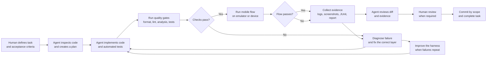

# Evidence-Driven AI Development Loop

This is the development loop used for agent-authored mobile changes. The goal
is not only to generate code, but to produce reproducible evidence that the
change works.

## What The Loop Verifies

1. **Intent**: the task has explicit acceptance criteria.
2. **Implementation**: the agent follows the existing architecture and keeps
   the change focused.
3. **Code quality**: formatting, static analysis, custom lints, duplication
   checks, and automated tests pass.
4. **Runtime behavior**: a compiled mobile app runs the critical flow against
   a real backend on an emulator or device.
5. **Evidence**: logs, screenshots, test results, and a machine-readable report
   are retained.
6. **Diagnosis**: failures are classified as application, test harness,
   backend, or infrastructure problems before code is changed.
7. **Review**: the agent reviews its own diff and a human reviews changes where
   product judgment or risk requires it.
8. **Learning**: repeated failures become new checks, fixtures, signatures, or
   documentation instead of remaining tribal knowledge.

## Definition Of Done

A task is complete when the acceptance criteria are met, automated checks pass,
required runtime flows pass, evidence is retained, and the change has received
the appropriate review.

The key principle is:

> Code generation is only one step. The loop is complete when the change is
> verified, observable, reviewable, and reproducible.
