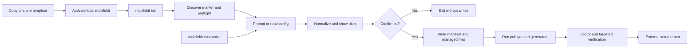

# Engineering Proposal: Initialize and Customize Mobile Core Kit Copies Through `mobilekit`

Date: 2026-08-01
Status: Draft proposal
Scope: First-use initialization and repository-local customization of copied
mobile-core-kit projects

Related:

- [Mobilekit CLI consolidation proposal](2026-08-01_mobilekit_cli_proposal.md)
- [Mobilekit command reference](../docs/engineering/mobilekit_cli_reference.md)
- [Template rename and rebrand guide](../docs/template/rename_rebrand.md)
- [Template environment configuration](../docs/template/env_config.md)
- [Firebase setup](../docs/engineering/firebase_setup.md)

## Decision Summary

Treat mobile-core-kit as a customizable application template, and make the
existing `mobilekit` CLI the owner of the first-use lifecycle.

The recommended user experience is:

```bash
dart pub global activate --source path packages/mobile_core_kit_cli
mobilekit init
```

`mobilekit init` should:

1. confirm that the command is operating on a supported template copy;
2. collect the application and repository identity through an interactive
   wizard, or read the same values from a non-interactive configuration file;
3. show a complete change plan before writing anything;
4. write a versioned, non-secret customization manifest;
5. apply controlled changes to Dart, Android, iOS, localization, deep-link,
   environment-example, and selected documentation surfaces;
6. run the existing dependency and generation workflows when their inputs are
   available; and
7. report external setup that still requires a human or an external service.

`mobilekit customize` should expose the same transformation engine for later
identity changes. It should be idempotent, support dry runs, and use the
manifest rather than broad search-and-replace.

The explicit activation command is intentional. An executable cannot install
itself before Dart has resolved the package and its dependencies. A thin
bootstrap script would reintroduce another public entry point and recreate the
tooling drift that the CLI migration removed. A documented one-line shell
recipe can be added later if the two-command bootstrap proves inconvenient.

The CLI and lint package names remain stable as harness identities:
`mobile_core_kit_cli` and `mobile_core_kit_lints` are not renamed when the
application package is customized.

## Context and Repository Evidence

This repository already contains a substantial application, platform
configuration, CI workflow, environment schema, generated configuration, and
Firebase bootstrap. The current customization path is primarily manual. The
[rename and rebrand guide](../docs/template/rename_rebrand.md) asks a developer
to update Android Gradle metadata, move Android package directories, update iOS
bundle identifiers and display names, replace Firebase configuration, and
review deep-link settings by hand.

The root [README](../README.md) also assumes that a developer has already
performed those changes before running `pub get`, configuration generation,
code generation, and the verification harness.

The current CLI is a suitable foundation: it already owns command routing,
FVM-aware process execution, repository workflows, dry-run conventions, and
testable command execution. It does not yet own template identity or
first-use setup.

The most important current defaults are:

| Concern | Current default | Main surfaces | Proposed treatment |
| --- | --- | --- | --- |
| Dart package identity | `mobile_core_kit` and `package:mobile_core_kit/...` | `pubspec.yaml`, `lib/`, `test/`, `integration_test/`, examples | Controlled package/import transformation |
| Display name | `Mobile Core Kit` | ARB files, Android manifest, iOS `Info.plist`, tests, selected docs | Update allowlisted product surfaces and report residuals |
| Android namespace | `com.example.mobile_core_kit` | `android/app/build.gradle.kts`, Kotlin package declaration/path | Derive or prompt separately; move the source path safely |
| Android application ID | `dev.fikril.mobile.corekit` with `.dev`/`.staging` suffixes | Android Gradle configuration, Firebase app registration | Prompt and validate; preserve flavor policy unless changed explicitly |
| iOS bundle ID | `dev.fikril.mobile.corekit` | Runner project build configurations, Firebase options | Update app target and derive a distinct test target ID |
| Deep-link host | `links.fikril.dev` | Android intent filters, iOS entitlements, env examples, parser tests/docs | Require an enabled host or an explicit disabled mode |
| Firebase project | `mobile-kit-5f1d6` | `firebase.json`, tracked `lib/firebase_options.dart`, native config when present | Never guess; keep, configure, or explicitly disable with a warning/gate |
| Template description | `A new Flutter project.` | Root `pubspec.yaml` | Replace from repository/app metadata |
| Repository-specific prose | Examples include `Orymu` and Mobile Core Kit references | CI comments and engineering docs | Use a residual-default report; do not rewrite historical records blindly |

The repository also has a root-detection gap for this use case. The current
`RepositoryRootLocator` recognizes a `pubspec.yaml` only when the directory
also has Git metadata or the legacy `tool/` directory. A copied template may
not have either one before initialization, and the old public tool directory
has already been removed. Initialization needs a checked-in template marker
such as `.mobilekit/template.yaml`.

The Firebase integration is active at application startup through
`DefaultFirebaseOptions.currentPlatform`. The tracked generated options point
at the demo Firebase project, while native Firebase files and environment
files are intentionally ignored. This means customization cannot safely treat
Firebase as a text-only identity replacement.

## Goals

- Make a fresh copy usable through a guided, repeatable first-use command.
- Replace template identity without requiring the user to manually edit source
  or platform files.
- Keep application identity, repository identity, and harness identity
  distinct.
- Cover the known default surfaces across Dart, Android, iOS, localization,
  deep links, environment examples, Firebase state, and selected docs.
- Preserve existing flavor, lint, verification, code-generation, and CI
  behavior unless the user explicitly chooses a different policy.
- Provide a safe rerun path when an application changes name, package, bundle
  ID, or domain later.
- Make unresolved defaults visible instead of silently claiming that a copy is
  production-ready.
- Keep the customization state reproducible and reviewable in Git.

## Non-goals

- Do not create Firebase projects, register platform apps, issue credentials,
  or upload configuration to a cloud service automatically.
- Do not collect or store secrets, signing keys, access tokens, passwords, or
  private certificates in the manifest, command arguments, logs, or reports.
- Do not create Android or iOS signing infrastructure as part of initialization.
- Do not rename the external Git remote, hosting repository, current directory,
  branch, CODEOWNERS, or GitHub secrets.
- Do not rename the Xcode project and targets from `Runner` in the first
  version. Bundle identity and display identity are the important product
  surfaces; target renaming is a separate native migration.
- Do not remove Firebase code merely because a project does not use Firebase.
  Disabling that integration is a separate architectural change.
- Do not replace the existing verification harness or move lint and duplication
  policy into the customizer.
- Do not perform unrestricted repository-wide string replacement or rewrite
  historical ADRs and engineering records.
- Do not generate a new logo or app icon from text prompts. Asset replacement
  may be validated or delegated to the existing asset workflow, but image
  creation is outside this tool.

## Constraints and Invariants

### Identity has separate namespaces

The wizard must not use one free-form “app ID” value for every platform. It
should collect or derive these independently:

- repository slug, normally kebab-case;
- application display name;
- Dart package name, normally derived from the slug as snake_case;
- Android namespace, which controls the Kotlin package path;
- Android application ID, including the existing flavor suffix policy;
- iOS application bundle ID; and
- deep-link mode and host.

The command should show normalized values and the derived flavor IDs before
confirmation. A user must be able to override the derived Android namespace or
iOS bundle ID when the two platforms use different organizational schemes.

### The manifest is tracked and non-secret

Initialization should create `.mobilekit/project.yaml` with a schema version,
template version, identity values, selected integration modes, and the list of
managed surfaces. It is a customization contract, not a credential store.

Runtime environment files remain the source of truth for environment-specific
API endpoints and OIDC client IDs. The manifest may record that those files
were initialized and which non-secret policy was selected, but it must not
duplicate or expose secrets. Existing ignored environment files must never be
overwritten without an explicit confirmation.

A representative manifest shape is:

```yaml
schema: 1
template: mobile_core_kit
template_version: 2026-08-01
repository:
  slug: example-shopping-app
  description: Example Shopping App
app:
  display_name: Example Shopping
  dart_package: example_shopping_app
platforms:
  android:
    namespace: com.example.shopping
    application_id: com.example.shopping
    flavor_suffixes:
      dev: .dev
      staging: .staging
  ios:
    bundle_id: com.example.shopping
deep_links:
  mode: disabled
  host: null
firebase:
  mode: configure
environment:
  examples_updated: true
```

The exact schema can evolve, but it must distinguish user-owned runtime files
from files derived by the customizer. A future CLI version should be able to
read an older schema and either migrate it or stop with an actionable message.

### The CLI package identity remains stable

The root package name and `package:mobile_core_kit` imports belong to the
application and must change. The path dependencies
`mobile_core_kit_cli` and `mobile_core_kit_lints` belong to the repository
harness and should remain stable in the first version. This keeps pinned CI and
local commands discoverable after a project is customized.

### Changes are allowlisted and transactional

The customizer should own a registry of transformation categories and their
file scopes. It should produce a plan first, write only known files, preserve
formatting where practical, and either complete the plan or restore the
pre-write state. It must not infer changes from arbitrary matching text.

The operation should be safe to rerun. Once initialized, the manifest is the
primary source for the prior identity, so a later rename does not depend on
finding the original template string in every file.

## Proposed Lifecycle



### `mobilekit init`

`init` is the first-use orchestrator. It should be idempotent and should not
assume that the copy already has a Git repository.

Its high-level behavior is:

1. Locate the root using `.mobilekit/template.yaml` and the root `pubspec.yaml`.
2. Refuse to operate on an unsupported directory or on a project whose
   manifest indicates a different template without an explicit override.
3. Load the current identity when available and collect missing values.
4. Run validation for names, package syntax, bundle IDs, hosts, path moves, and
   collisions before touching files.
5. Print a categorized diff/plan, including files that will be skipped and
   external steps that cannot be automated.
6. On confirmation, write the manifest and apply the transformation registry.
7. Run `flutter pub get`, localization generation, configuration generation,
   and code generation only when their required inputs are valid. Existing
   CLI workflows should be reused rather than reimplemented.
8. Run read-only diagnostics and print the next steps for Firebase, signing,
   backend configuration, domains, icons, and CI secrets.

The command should support interactive use and a reproducible mode such as:

```bash
mobilekit init --config .mobilekit/project-input.yaml
```

The input file may contain values that are not persisted to the tracked
manifest, but secrets should still be rejected rather than merely hidden.

If environment values are missing, `init` should create or refresh only the
example files and report that local `.env/*.yaml` values are still required. It
must not prompt for API endpoints or OIDC client IDs, write fake values, or
report a successful build configuration without valid environment inputs.

### `mobilekit customize`

`customize` is the rerunnable version of the same flow. It should:

- load `.mobilekit/project.yaml` as the baseline;
- permit an interactive or config-file change to one or more identity values;
- show affected files grouped by concern;
- support `--dry-run` without changing the worktree;
- require explicit confirmation for writes;
- update derived files and generated outputs consistently; and
- finish with a residual-default and verification report.

If the user has edited a managed file since the previous customization, the
command should identify the conflict and stop or require an explicit override.
It should never silently discard those edits.

### Bootstrap and installation

The current CLI is a path dependency and an executable package. The supported
bootstrap remains:

```bash
dart pub global activate --source path packages/mobile_core_kit_cli
mobilekit init
```

`mobilekit init` may verify that the globally activated executable resolves to
the current checkout and may print the activation command when it does not.
It should not silently upgrade a global executable from an arbitrary path.

The root command must also remain available for pinned automation:

```bash
dart run mobile_core_kit_cli:mobilekit init
```

The global install is a convenience for humans; the repository-local command
is the reproducible source of behavior for CI and tests.

## Transformation Ownership

The customizer should use explicit transformation categories rather than a
single replacement map.

| Category | Owned changes | Important boundary |
| --- | --- | --- |
| Application package | Root `pubspec.yaml` name and Dart package imports under application/test sources | Do not rename the CLI or lint package names |
| Product branding | Localized `appTitle` values, Android label, iOS display/name, selected README/template references | Preserve pseudo-localization markers; report unknown prose instead of rewriting it |
| Android identity | Gradle namespace/application ID, flavor-derived IDs, Kotlin package declaration, and source directory move | Validate namespace and application ID separately; preserve signing and flavor behavior |
| iOS identity | Application bundle ID, test bundle ID policy, display name, and Firebase/deep-link identity references | Leave `Runner` project/target names unchanged in v1 |
| Deep links | Environment examples, Android intent filters, iOS entitlements, parser fixtures, and selected docs | `enabled` requires a valid HTTPS host; `disabled` must remove platform claims consistently |
| Environment setup | Example YAML values governed by identity choices, such as deep-link policy | Runtime endpoints, OIDC IDs, and ignored local files remain user-owned; never write credentials into the manifest |
| Firebase | Mode/status and delegation to `flutterfire configure` | Do not synthesize project IDs, API keys, native files, or credentials |
| Repository/docs | Root description, selected current template instructions, and residual-default report | Do not rename remotes/directories or rewrite historical ADRs automatically |

The Android and iOS transforms need target-aware behavior. For example, an iOS
project currently contains several `PRODUCT_BUNDLE_IDENTIFIER` settings for
the application and test targets; replacing every occurrence with the same
value is not a safe customization. The application bundle ID and test bundle
ID should have a documented relationship and be validated independently.

The deep-link transform must also update the Dart/runtime configuration, not
only native declarations. The current parser receives its allowed hosts from
generated build configuration, while tests and integration fixtures contain
the existing host as a literal. A successful customization must keep those
layers consistent.

## Firebase and External Integrations

Firebase needs an explicit three-state policy:

- `configure`: update platform identity first, then offer to run
  `flutterfire configure` for the selected project and platforms;
- `keep-demo`: preserve the current demo configuration for template-only
  verification, but mark it clearly in `mobilekit doctor` and block or require
  explicit acknowledgement for production verification; and
- `disabled`: record that the project does not intend to configure Firebase,
  but do not delete Firebase code in this proposal.

The wizard may ask for a Firebase project identifier or let the user invoke
FlutterFire interactively. It must not ask for API keys or private credentials
as text fields. The generated `firebase_options.dart` and ignored native
configuration files should be treated as outputs of the external integration,
not hand-maintained replacement targets.

The same rule applies to signing, backend deployment, domain ownership, CI
secrets, Google OAuth registration, and app-store metadata. `init` should
produce a checklist and machine-readable status where useful, but the user
must perform or explicitly authorize those external operations.

## Repository Name and Documentation Boundary

“Repository name” has two meanings and the command must distinguish them:

1. The in-repository slug and product references can be stored in the manifest
   and applied to an allowlisted set of current documentation and metadata.
2. The directory name, Git remote, GitHub/GitLab repository, branch, owners,
   secrets, and hosting settings are external state and are outside the
   customizer's authority.

The command should therefore update the local project description and selected
current guides, then print any required hosting/remote rename steps. It should
not claim that the repository has been renamed when only local text changed.

`mobilekit doctor` should scan for known template markers after customization,
including `Mobile Core Kit`, `mobile_core_kit`, the old Android/iOS IDs, the
old deep-link host, the demo Firebase project, and unresolved example
environment values. The report should distinguish:

- blocking runtime or packaging defaults;
- review-required documentation/default comments; and
- historical references intentionally left unchanged.

This gives future agents and developers a searchable, deterministic way to
find anything the allowlist did not cover.

## Safety and Failure Behavior

- **Dry run first:** every transformation must be previewable without writes.
- **Explicit confirmation:** interactive runs confirm the normalized identity
  and the affected file groups before applying.
- **Atomic application:** write through temporary files or a transaction-like
  backup set and restore on failure.
- **Dirty-worktree protection:** detect changed managed files and stop with an
  actionable conflict report; never overwrite them silently.
- **Idempotency:** rerunning with the same manifest produces no new changes.
- **No broad replacement:** use structured parsing or anchored transformations
  for Gradle, plist, YAML, ARB, Dart imports, and Xcode settings.
- **No secret leakage:** redact values in logs and reject credentials in
  tracked input files.
- **External work is visible:** every skipped Firebase, signing, domain, CI, or
  store operation appears in the final report.
- **Failure is incomplete, not successful:** if generation or validation fails,
  `init` returns a non-zero status and identifies the first actionable cause.

The root locator should replace the stale `tool/` fallback with the checked-in
`.mobilekit/template.yaml` marker while retaining support for an already
initialized project through `.mobilekit/project.yaml`.

## Alternatives and Trade-offs

### Keep the manual rename guide only

This has the lowest implementation cost, but it already requires coordinated
changes across package imports, native metadata, Firebase, deep links, tests,
and generated files. It is easy to miss a surface and difficult to verify
consistently.

### Use global search-and-replace

This is quick for `Mobile Core Kit` and `mobile_core_kit`, but it can modify
historical records, third-party examples, generated code, test-target IDs, and
unrelated prose. It cannot safely express platform-specific identity rules or
Firebase ownership.

### Generate a new Flutter project and copy the application code into it

This avoids some default platform metadata, but it discards or reintroduces
the repository's architecture, CI, lint, environment, and harness decisions.
It also makes future template synchronization harder.

### Maintain a separate external template generator

This could eventually provide a cleaner upstream/downstream model, but it adds
another repository and synchronization process. The existing project already
contains the CLI package and the authoritative files, so a repo-local
customizer is the smaller first step.

### Add a second dependency-free bootstrap script

This could make installation appear to be one command, but it creates another
public workflow and has to duplicate platform/tool discovery before the Dart
CLI can run. The explicit activation followed by `mobilekit init` is more
portable and keeps ownership in one CLI.

## Delivery Shape

Implementation should be staged so that each step remains reviewable:

1. Establish the `.mobilekit` marker/manifest contract and update root
   discovery without changing customization behavior.
2. Add pure validation and transformation planning with fixture-based tests.
3. Add transactional application and the interactive/non-interactive command
   flow.
4. Connect existing generation, diagnostics, and verification workflows.
5. Add Firebase/external-setup reporting and residual-default detection.
6. Document the bootstrap and migration path, then collect Android and iOS
   runtime evidence from a representative initialized copy.

This proposal intentionally does not prescribe a file-by-file execution plan.
That plan should be written after the design is accepted and should include
the repository's normal verification commands from `AGENTS.md`.

## Acceptance Criteria

The proposal is implemented successfully when all of the following are true:

- A copied template can be located and initialized before `git init` by using
  the template marker.
- The documented bootstrap installs the local CLI, and both global `mobilekit`
  and pinned `dart run ...:mobilekit` paths can invoke `init`.
- Interactive initialization collects app display name, repository slug,
  Dart package name, Android namespace/application ID, iOS bundle ID, and
  deep-link policy, with derived values shown before confirmation.
- A non-interactive input produces the same normalized plan as the interactive
  wizard.
- The application package rename updates imports and native source paths
  without changing the stable CLI/lint package identities.
- Android, iOS, localization, deep-link, environment-example, and selected
  documentation surfaces are updated consistently, with a residual-default
  report for anything outside the allowlist.
- iOS application and test bundle identifiers are handled according to an
  explicit target-aware policy rather than a blind global replacement.
- `--dry-run` leaves the worktree unchanged, and a failed apply does not leave
  a partially customized identity.
- Repeating initialization or customization with the same manifest is safe and
  produces no spurious changes.
- Existing ignored environment and native Firebase files are never silently
  overwritten.
- No Firebase credential or signing material is collected or committed, and a
  project retaining demo Firebase configuration is clearly reported and cannot
  pass a production-readiness check without explicit resolution.
- Generated localization/configuration/codegen outputs are refreshed through
  existing workflows, not hand-edited by the customizer.
- Unit tests cover manifest parsing, validation, normalization, conflict
  detection, and each transformation category.
- An integration fixture copies the template, runs the non-interactive flow,
  checks the resulting metadata/imports, and confirms idempotency.
- Android and iOS debug/dev builds provide runtime evidence that the customized
  identifiers, display name, deep-link policy, Firebase mode, and generated
  configuration remain coherent.
- The existing `mobilekit` verification and custom-lint checks remain green
  after customization.

## Resolved Decisions

The initial design questions are resolved as follows:

1. **`init` enters customization automatically.** It is the single post-
   activation first-use flow. `customize` remains available for later changes,
   and a future `--no-customize` mode may be reserved for harness-only setup.
2. **Deep links are optional.** The manifest and runtime configuration must
   support an explicit `disabled` mode instead of forcing every copy to use
   `links.fikril.dev` or another placeholder host.
3. **Firebase is not configured automatically.** Initialization offers an
   explicit FlutterFire handoff after identity changes and treats demo state as
   a visible production blocker.
4. **API endpoints and OIDC client IDs are not prompted during initialization.**
   Environment setup remains outside the identity wizard. The customizer may
   update example values that are directly controlled by identity choices, but
   runtime endpoints, OIDC IDs, and ignored local environment files remain
   user-owned and are reported as follow-up configuration.
5. **The Xcode `Runner` target is not renamed in v1.** The native project
   structure stays stable; target renaming is a separate migration with its
   own runtime validation.
6. **The command does not rename the current directory or remote repository.**
   It stores the desired slug, updates local allowlisted metadata, and reports
   the external rename steps.
