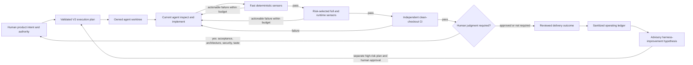

# Agent-First Mobile Harness And Loop Engineering Proposal

**Date:** 2026-08-10

**Status:** Approved 2026-08-10; implementation in progress

**Scope:** `mobile-core-kit` repository harness, agent workflow, verification,
runtime evidence, CI, and controlled harness improvement

**Research:** [Mobile Harness And Loop Engineering Research](2026-08-10_mobile-harness-loop-engineering-research.md)

## Recommendation

Evolve `mobile-core-kit` from a repository with strong quality gates into a
risk-aware, closed-loop engineering system designed for agent-first
implementation.

Keep the existing architectural direction:

- Clean Architecture with feature-first vertical slices;
- graduated feature decomposition rather than forced folder symmetry;
- GetIt only at composition edges;
- Bloc/Cubit presentation state;
- repository-owned `mobilekit` CLI and custom lints;
- simple, explicit code with no speculative abstractions.

Add the missing control layers:

- machine-checkable task intent, scope, risk, and authority;
- canonical fast/full/runtime/CI verification profiles;
- risk-selected verification and bounded repair;
- isolated current-agent workspaces;
- sanitized task and runtime evidence;
- independent CI reproduction;
- read-only event-driven maintenance;
- controlled, evidence-based hill climbing.

The target is not an autonomous software company inside the repository. The
target is a repository where an authorized AI agent can implement a bounded
change, prove it, repair attributable failures, and hand back a small evidence
package while humans focus on product meaning, architecture, risk, and
sensitive actions.

Implementation was authorized on 2026-08-10. Each phase still requires its own
execution plan and verification evidence before the next phase begins.

## Context

The repository already has the right foundation:

- `mobilekit` centralizes verification, scaffolding, template customization,
  runtime logs, and device evidence;
- custom lints enforce architecture, vendor boundaries, API authentication
  declarations, navigation, localization, modal entrypoints, and design tokens;
- `docs/exec-plans/` records non-trivial work;
- CI builds Android and iOS, runs tests, checks coverage and goldens, and scans
  dependencies and secrets;
- runtime tooling can execute integration tests on a named device and preserve
  logs and screenshots;
- the operating contract already says that repeated failures should become
  harness improvements.

However, these parts are not yet connected into an auditable loop:

- plans describe risk and scope only as prose;
- `project-map verify` currently succeeds by skipping its check;
- canonical verification does not run the CLI package's own tests;
- local and CI verification strengths differ by flags and extra workflow steps;
- runtime evidence is not selected from risk or bound to an exact source state;
- failed verification has no stable category, bounded repair count, or
  deterministic escalation;
- CI does not expose one canonical risk/full/runtime aggregate;
- the repository records no sanitized operating outcomes from which a harness
  improvement could be evaluated.

The result is a strong set of sensors with a mostly manual controller.

## Goals

- Make product intent, architecture, task authority, and verification
  requirements legible to a fresh agent context.
- Allow agents to own bounded implementation, focused tests, documentation,
  mechanical repair, and evidence collection.
- Preserve Clean Architecture and simple code as enforceable invariants.
- Select verification depth from effective risk and runtime impact.
- Make failures attributable and actionable without storing sensitive raw
  traces.
- Protect user-owned dirty work and concurrent tasks through isolated
  worktrees.
- Make local claims independently reproducible in clean CI.
- Move human review toward acceptance meaning, architecture, security,
  product/visual judgment, and sensitive external actions.
- Improve the harness from repeated real outcomes rather than reviewer memory.
- Keep the harness itself small, repository-local, testable, and reversible.

## Non-Goals

- Replacing Clean Architecture or weakening dependency rules.
- Requiring uniform layers for simple features.
- Building a general-purpose agent platform or launching nested coding agents
  from repository code.
- Autonomous product discovery, architecture decisions, or risk acceptance.
- Autonomous merge, deployment, signing, migration, production data changes,
  secret rotation, billing, or external user communication.
- Trusting an LLM reviewer or agent-authored unit tests as a correctness oracle.
- Running every expensive sensor for every small change.
- Recording prompts, hidden reasoning, raw logs, credentials, environment
  values, request bodies, tokens, cookies, PII, or unrestricted diffs in a
  durable ledger.
- Copying the backend or frontend harness implementation into Dart.
- Introducing a database, queue, daemon, or agent framework for local harness
  state.

## Operating Principles

### Humans own meaning and authority

A human-approved task contract defines the observable outcome, non-goals,
architecture constraints, maximum risk, and permitted actions. The agent can
choose a simple implementation inside those boundaries. It cannot weaken an
acceptance scenario, expand its scope, lower risk, or infer publication
authority to make the task pass.

### Agents own bounded execution

Within explicit authority, the current coding agent may inspect, edit, add
tests, update relevant docs, run registered verification commands, repair
failures, and collect evidence. It should escalate only when judgment,
authority, an unavailable external dependency, or a deterministic stop
condition requires a human.

### Deterministic controls are authoritative

Analyzer results, custom lints, structural rules, generated-artifact drift,
tests, contract checks, builds, and runtime assertions are the primary sensors.
Agent reviews provide semantic judgment but remain advisory until a conclusion
becomes an accepted decision or deterministic rule.

### Important behavior needs an independent oracle

The implementation agent may write unit tests, but medium/high-risk acceptance
must be anchored by at least one independently owned source:

- a human-approved acceptance scenario;
- an existing regression test;
- a repository-owned or pinned backend contract;
- an approved fixture or golden baseline;
- a device integration test or manual QA procedure;
- a separately calibrated review rubric.

### Clean Architecture is a harness primitive

Dependency direction reduces the range of possible implementations and makes
the code easier for future agents to navigate. The current architecture lints
are immutable safety invariants for the loop. A harness improvement may make
diagnostics clearer or add enforcement, but it may not bypass feature, domain,
core, navigation, or composition-root boundaries.

### Verification is risk-tiered and cost-aware

Cheap checks run early and repeatedly. Device, platform, security, and broad
runtime checks run only when risk and impact require them. Every expensive
sensor needs a measured reason to exist.

### Repeated failure changes the system

Two similar failures create a candidate harness observation, not an automatic
rule. A durable harness change requires evidence that the pattern recurs, a
falsifiable improvement hypothesis, tests for the control itself, human
approval, and later keep/revert evaluation.

### Harness assumptions expire

Every harness component encodes an assumption about what agents cannot do
reliably. As models improve, unnecessary scaffolding should be removed one
piece at a time after evidence shows no quality regression.

## Proposed Closed-Loop System



The loops have separate ownership:

1. **Intent loop:** human defines outcome, constraints, risk, and authority.
2. **Agent loop:** current agent makes small progress in an owned workspace.
3. **Verification loop:** deterministic sensors return actionable feedback;
   repair is bounded.
4. **Integration loop:** runtime and clean CI reproduce the required outcome.
5. **Event loop:** approved queued work and read-only maintenance trigger
   one-shot operations.
6. **Steering loop:** independently reviewed outcomes inform one controlled
   harness hypothesis.

## Proposed Design

### 1. Keep `mobilekit` as the single harness surface

Do not add a second CLI. Extend the existing Dart package while keeping clear
internal boundaries between:

- template lifecycle and customization;
- repository verification profiles;
- knowledge and plan validation;
- task authority and state;
- risk and lane selection;
- runtime evidence;
- worktree and handoff adapters;
- operating evidence and improvement analysis.

The CLI must remain harness-only. Application code under `lib/` must never
import CLI code. Repository policy remains in visible config and docs rather
than being hidden in command implementations.

Package scripts and documented commands may remain compatibility aliases, but
they must delegate to one profile owner.

### 2. Canonical verification profiles

Replace the ambiguous single “canonical” invocation with explicit profiles:

| Profile | Intended scope |
| --- | --- |
| `fast` | environment preflight, knowledge/plan validity, format, analyzer, custom lints, focused harness/application tests |
| `full` | fast plus generated-artifact freshness, all root and harness-package tests, coverage/maintainability checks, core and small-helper duplication according to accepted policy |
| `runtime` | selected device integration targets, goldens or platform evidence required by task impact |
| `ci` | clean-checkout full plus selected runtime/platform and governance lanes |

The exact step registry is implementation detail, but these invariants apply:

- profiles have one typed source of truth;
- local and CI aliases call the same owners;
- CI may add required lanes and may not accept weaker agent selection;
- codegen and duplication semantics are explicit and consistent with docs;
- CLI and custom-lint package tests are part of harness verification;
- profile definitions and parity have focused negative tests;
- Flutter resolution follows one pinned SDK contract locally and in CI;
- failures return stable identifiers and remediation guidance.

Before enforcing new budgets, capture a baseline of profile duration, test
inventory, coverage, duplication, and known blind spots.

### 3. Structured execution-plan authority

Execution-plan V2 becomes the human-readable, machine-checkable contract for a
non-trivial agent task.

Required authority metadata:

| Field | Meaning |
| --- | --- |
| Plan version and task ID | Stable schema and task identity |
| Status and owner | Lifecycle and accountable human/agent role |
| Risk and maximum risk | Declared risk and hard ceiling |
| Allowed paths | Exact repository-relative files or directory prefixes |
| Allowed actions | Separate `edit`, `verify`, `commit`, `push`, and `draft-pr` authority |
| Repair limit and timeout | Deterministic stop conditions |
| Impact areas | Auth/session, navigation, API, DB, platform, UI, harness, release, external systems |

The narrative plan still records objective, current evidence, decisions,
non-goals, acceptance scenarios, rollback, and verification mapping. Parsing a
plan never creates authority; it only validates authority already granted by a
human-authored task contract.

Historical completed plans remain records and need not be rewritten. New
active and queued plans adopt V2 prospectively.

### 4. Task state, path ownership, and effective risk

`mobilekit task begin` records ignored, atomic, schema-versioned local state:

- authorized plan path and content hash;
- base Git revision;
- pre-existing dirty paths and content fingerprints;
- allowed paths and actions;
- declared and maximum risk;
- task state and attempt counters.

Pre-existing dirty paths remain user-owned only while their fingerprints are
unchanged. A later task edit makes the path task-owned and subject to scope and
risk rules.

Effective risk is the maximum of human-declared risk and conservative path/
impact-derived risk. Automation can raise it and cannot lower it.

Initial risk rules should treat these areas as high until evidence supports a
different policy:

- auth, session, token refresh, user hydration, and account deletion;
- database schema or migration behavior;
- API contracts, request authentication, and external adapters;
- navigation redirects, deep links, and startup gates;
- Firebase, permissions, push, device identity, secure storage, signing;
- dependencies, code generation, CI, release, `mobilekit`, custom lints, and
  harness policy.

Ordinary feature behavior is at least medium. Narrow non-policy docs can be
low. Unknown executable paths default to medium.

### 5. Risk-aware verification and bounded repair

`mobilekit task verify` performs:

1. plan, authority, repository, workspace, and changed-path preflight;
2. effective-risk and impact classification;
3. canonical lane selection;
4. fail-fast execution;
5. stable failure categorization and sanitized diagnostic capture;
6. task-state transition.

Representative stable boundaries include:

- `knowledge.plan`
- `knowledge.project_map`
- `format.dart`
- `analysis.flutter`
- `analysis.custom_lint`
- `codegen.drift`
- `test.application`
- `test.mobilekit_cli`
- `test.custom_lints`
- `duplication.core`
- `duplication.small_helpers`
- `runtime.android`
- `runtime.ios`
- `runtime.golden`
- `contract.openapi`
- `ci.independent`

A task fingerprint covers plan authority, base revision, effective risk,
task-owned paths, and their content. Repeating the same failed boundary without
a meaningful fingerprint change consumes a repair opportunity. Meaningful
progress resets the relevant repeat count. Exhaustion, timeout, scope escape,
ambiguous state, or unavailable required infrastructure escalates instead of
looping indefinitely.

The controller reports failures; the current conversational agent performs
repairs through ordinary tools. Repository code does not invoke another model.

### 6. Current-agent workspace isolation

For a controller-managed task, `mobilekit` prepares a deterministic branch and
linked worktree under ignored task state. The current agent uses that path as
its working directory.

Required behavior:

- task identity, base revision, plan hash, branch, and canonical worktree path
  are validated before every controlled transition;
- primary-worktree dirty files are not copied into the task workspace;
- status can be rediscovered after context compaction or interruption;
- cancellation records lifecycle state but does not kill the host agent;
- cleanup refuses a dirty or ambiguous worktree and preserves the branch for
  inspection;
- one repository command lock protects worktree mutations;
- parallel tasks require separate worktrees and disjoint authorized paths.

Mobile device lanes are single-flight by default. Running multiple installed
copies per worktree would require flavor/application-ID management and should
not be introduced until operating evidence shows that serial device evidence
is a material bottleneck.

### 7. Mobile behavior oracles and runtime evidence

Static correctness and device behavior remain separate evidence lanes.

For medium/high-risk changes, the task contract maps acceptance scenarios to
one or more registered oracles:

- root unit/widget/bloc test;
- existing regression test;
- generated or pinned OpenAPI contract;
- golden baseline;
- Android integration target;
- iOS integration target;
- startup metric or log assertion;
- explicit manual QA procedure where automation is not credible.

Runtime evidence is bound to the exact task fingerprint and records only
sanitized metadata:

- task and plan ID/hash;
- base and candidate revision/fingerprint;
- device/emulator model identifier appropriate for publication;
- platform, flavor, and target IDs;
- start/end time and duration;
- pass/fail and stable boundary;
- artifact paths and hashes;
- redacted selected signals.

Raw logs remain transient, access-restricted, size-limited, and covered by
secret/PII negative tests. Absolute local repository paths, environment values,
credentials, authorization headers, request bodies, raw responses, and full
trace dumps do not enter durable summaries or ledgers.

Runtime preparation should happen inside the owned workspace or an explicit
temporary directory. Supplying Firebase configuration must not silently mutate
the user's primary worktree.

### 8. Repository-owned API contract evidence

The current absolute sibling path to `backend-core-kit` is useful for a human
on one machine but is not a clean-checkout source of truth.

Adopt a repository-owned or pinned OpenAPI artifact for agent and CI
verification. The precise synchronization mechanism is a follow-on decision,
but it must provide:

- a reviewable contract revision;
- deterministic drift or generation checks;
- no dependency on a developer-specific absolute path;
- compatibility with product repositories cloned from the template;
- explicit ownership of when backend contract changes are accepted.

This contract supplies an independent oracle for DTOs, endpoints, auth
requirements, and failure shapes without changing Clean Architecture layering.

### 9. Independent CI and verified handoff

CI independently verifies a clean checkout and never trusts local task state as
pass evidence.

Conceptual lanes:

```text
CI Risk        base/head path and V2 plan classification
CI Full        canonical full profile
CI Runtime     selected Android/iOS/golden/device evidence
CI Governance  dependency review, secret scan, policy checks
CI Required    stable aggregate status
```

Workflows use pinned tool versions, immutable third-party action SHAs, least
privilege, bounded timeouts, concurrency cancellation, and sanitized artifact
retention. CI should prove the CLI and custom-lint packages as well as the
application.

Successful local verification means `ready_for_review`, not permission to
publish. Commit, push, and draft PR are separate, action-specific handoffs. If
implemented, each adapter requires fresh evidence, exact task paths, approved
branch/remote identity, explicit user authorization, and an expiring one-time
approval. Force push, merge, deployment, signing, migration, and release remain
absent.

### 10. Event-driven operation

Start with internal one-shot commands, not a daemon:

- activate one already-authorized queued V2 plan;
- deduplicate delivery by stable event identity;
- refuse multiple active tasks unless isolated concurrency is explicitly
  supported;
- run scheduled read-only maintenance;
- leave source mutation to a separately authorized task.

Initial maintenance registry:

- knowledge and plan lifecycle check;
- architecture-policy and source drift report;
- duplication observations;
- dependency and codegen drift observations;
- stale runtime-evidence and active-plan report;
- harness package tests and gate-honesty fixtures.

An event can notify or select authorized work. It cannot derive new paths,
actions, risk, credentials, or publication authority from issue text, webhook
payloads, logs, or comments.

### 11. Operating evidence

Ignored task episodes support local repair; they are not automatically durable
truth. Promotion into a checked-in operating ledger requires:

1. a real terminal task outcome;
2. independent human review;
3. clean-checkout CI reproduction from the recorded candidate;
4. a separately authorized ledger edit;
5. schema and privacy validation;
6. normal source review.

Ledger records contain stable categorical data only:

- task ID, completed-plan path/hash, risk class, and impact categories;
- first-pass and eventual outcome;
- selected lanes, durations, and stable failed boundary;
- repair or escalation category;
- CI reproduction and independent-review markers;
- harness version/revision.

No prompt, reasoning, raw output, source diff, unrestricted prose, environment
value, credential, token, request body, user data, or private artifact is
allowed.

### 12. Controlled hill climbing

Harness improvement is disabled until the ledger contains enough diverse,
reviewed outcomes. Recommended initial eligibility:

- at least five unique tasks;
- at least two risk classes;
- at least one repair or escalation;
- every record independently reviewed and reproduced in CI;
- no unresolved schema, redaction, or privacy issue.

Eligibility does not establish statistical significance and grants no
authority. It only permits an advisory hypothesis.

Each hypothesis identifies:

- recurring stable pattern and affected baseline task IDs;
- harness target component;
- measured baseline;
- minimum predicted improvement and cost effect;
- later evaluation window excluding baseline tasks;
- immutable invariants;
- exact rollback files;
- human owner and approver.

Immutable invariants include no authority expansion, no risk lowering, no
verification weakening, no architecture-boundary weakening, no sensitive-data
expansion, and no publication expansion.

The change runs under a separate high-risk harness plan, first in shadow mode.
Later reviewed outcomes determine a `keep`, `revert`, or `inconclusive`
recommendation. A human owns the terminal decision. The controller cannot edit
policy, create its own plan, approve itself, or publish its own work.

## Risk And Human-Gate Policy

| Risk | Typical examples | Minimum evidence | Human responsibility |
| --- | --- | --- | --- |
| Low | narrow docs, formatting, deterministic generated metadata | fast/full as selected, clean CI | intent and spot review |
| Medium | feature behavior, UI, navigation, DTO mapping, local persistence | approved acceptance, full, selected runtime, CI | acceptance and visual/runtime judgment |
| High | auth/session, account deletion, contracts, platform security, CI/harness, dependencies, release | approved plan, independent oracle, full/runtime/governance, CI | architecture/security review and merge decision |
| Restricted | production data, signing keys, store publication, destructive migration, billing, external messaging | explicit operational runbook and live approval | human performs or directly supervises action |

Risk and authority are independent. A low-risk task is not automatically
authorized to commit or publish. A high-risk task may be authorized to edit and
verify while merge remains human-only.

## Security And Privacy Boundaries

### Trust classification

- **Trusted after validation:** repository policy at the authorized base,
  approved plan snapshot, controller code, registered commands, pinned contract
  artifacts.
- **Untrusted:** agent messages and output, code read as task data, issue/PR
  text, external pages, command output, logs, API responses, event payloads.
- **Sensitive:** local paths, unpublished diffs, device logs, screenshots,
  runtime artifacts, repository and device metadata.
- **Secret:** tokens, signing material, Firebase credentials, private keys,
  session data, authorization headers, production endpoints containing
  credentials.

### Required controls

- canonical path and symlink-boundary validation;
- exact allowed paths rather than globs or repository-root authority;
- registered verification commands rather than plan-injected shell;
- atomic mode-restricted local state;
- redaction and size limits before diagnostics persist;
- negative fixtures for representative secret and PII shapes;
- no production credentials in controller state or operating evidence;
- separate approval for every external mutation;
- fail closed when an external action has an uncertain result;
- human review for auth, security, migration, release, and harness changes.

Prompt injection cannot be solved by instructions alone. Scope, command,
authority, and publication policy must be enforced outside the model.

## Knowledge Architecture

Keep `AGENTS.md` short enough to function as an operating contract and map. Do
not add the complete loop protocol to it.

Durable ownership:

- `AGENTS.md`: entry contract, source-of-truth map, non-negotiables;
- `docs/engineering/`: stable workflows and architecture policy;
- `ADR/records/`: accepted durable decisions;
- `docs/exec-plans/`: task authority, progress, decisions, and evidence;
- `_WIP/`: research and proposals that are not yet normative;
- source-local `README.md`: non-obvious local ownership and runtime boundaries;
- generated reports: reproducible observations, clearly marked as generated.

A knowledge check should validate links, lifecycle, indexing, required plan
fields, core map, and known generated artifacts. It should not attempt to use
an LLM to decide whether prose is correct. Scheduled doc gardening may propose
semantic changes, but normal review accepts them.

## High-Level Delivery Phases

### Phase 1 — Harness truthfulness and canonical profiles

Make existing claims reliable: real knowledge/plan validation, explicit
profiles, package-test inclusion, codegen/duplication policy alignment, pinned
Flutter resolution, CI parity tests, and measured baselines.

### Phase 2 — Structured task authority

Introduce V2 plans, local task baselines, exact path/action authority,
pre-existing-change ownership, impact declarations, and conservative risk
classification.

### Phase 3 — Risk-aware verification and bounded repair

Introduce task verification, stable failure taxonomy, fingerprints, selected
lanes, finite repair opportunities, sanitized diagnostics, and explicit
escalation states.

### Phase 4 — Isolated current-agent execution

Introduce linked worktree preparation, status rediscovery, workspace-aware
verification, safe cancellation/cleanup, and single-flight device policy. Do
not launch nested agents.

### Phase 5 — Behavioral oracles and mobile evidence

Bind acceptance scenarios to registered tests/contracts/goldens/device
procedures, establish repository-owned API contract evidence, sanitize runtime
artifacts, and add independent CI runtime coverage where feasible.

### Phase 6 — Event intake, maintenance, and verified handoff

Add one-shot queued-plan intake, idempotent event receipts, read-only scheduled
maintenance, clean CI risk/full/runtime/governance aggregation, and narrowly
authorized commit/push/draft-PR handoff if later approved.

### Phase 7 — Operating evidence

Calibrate coverage and duration, add gate-honesty fixtures, consider one narrow
mutation pilot, and promote independently reviewed task outcomes into a strict
sanitized ledger.

### Phase 8 — Controlled hill climbing

Add deterministic trend aggregation, falsifiable improvement hypotheses,
isolated high-risk harness tasks, shadow evaluation, and human keep/revert
decisions. Keep the loop disabled until evidence eligibility is met.

Each phase must be useful independently. Later phases do not begin merely
because code for an earlier phase exists; its acceptance evidence must be met.

## Compatibility And Rollback

- Keep current `mobilekit` commands working while profiles become explicit.
- Introduce task control in report-only mode before enforcement.
- Keep manual development possible when no V2 task is active.
- Version all plan, state, episode, and ledger schemas; reject unsupported
  versions.
- Keep task enforcement, workspace isolation, runtime evidence, handoff,
  events, and improvement analysis independently disableable.
- Preserve candidate branches/worktrees when cleanup safety is uncertain.
- Roll back harness changes by exact files without touching application data.
- Require clean CI before an enforcement mode replaces report-only behavior.

## Risks And Tradeoffs

### Harness overengineering

The control system could become larger and harder to maintain than the app
behavior it protects.

Mitigation: extend one existing CLI, use filesystem state, implement one phase
at a time, require observed value, and remove scaffolding when models no longer
need it.

### Test-oracle circularity

An agent can implement both a misunderstanding and tests that confirm it.

Mitigation: human-approved acceptance, pre-existing regressions, backend
contracts, approved fixtures/goldens, device evidence, and human review at
high-risk boundaries.

### Verification latency

Flutter builds, codegen, goldens, and device tests can dominate task time.

Mitigation: measured profiles, cheap preflight, risk-selected lanes, fail-fast
ordering, bounded repairs, and serial device evidence until parallelism proves
valuable.

### Evidence leakage

Logs, screenshots, Firebase setup, and runtime metadata can expose sensitive
values.

Mitigation: transient raw artifacts, redaction, size and retention limits,
negative tests, sanitized durable schemas, and no primary-worktree secret
copying.

### Architecture ossification

Overly broad rules can preserve accidental structure instead of stable
boundaries.

Mitigation: enforce dependency direction and ownership, not folder symmetry or
implementation style. Architecture changes remain human decisions recorded in
new ADRs.

### Optimizing the grader

A self-improving harness may reduce failures by weakening checks or selecting
easier tasks.

Mitigation: immutable invariants, independent CI, baseline exclusion, shadow
evaluation, human approval, later outcome comparison, and exact rollback.

### Cross-kit divergence

Mobile, frontend, and backend could invent incompatible task and evidence
contracts.

Mitigation: align conceptual schemas and policy vocabulary while keeping each
platform's CLI implementation local. Share code only after multiple consumers
prove a stable common requirement.

## Acceptance Conditions

The proposed program is complete only when:

1. `mobilekit` remains the single repository harness surface.
2. Fast, full, runtime, and CI profiles have one tested owner and truthful docs.
3. The canonical full profile proves the app, CLI package, and custom-lint
   package.
4. Knowledge checks fail on broken links, invalid plan lifecycle, and project
   map drift rather than silently skipping.
5. A controller-managed task cannot start with invalid authority, ambiguous
   paths, unsupported plan state, or declared risk above its maximum.
6. Changed paths may raise effective risk and select additional lanes.
7. The current agent works in an owned worktree without modifying user-owned
   primary-worktree changes.
8. Verification failures carry stable categories, bounded diagnostics, and
   finite repair opportunities.
9. Repeated unchanged failure, scope escape, timeout, or ambiguous recovery
   escalates deterministically.
10. Medium/high-risk behavior maps to an independent acceptance oracle.
11. Runtime evidence is bound to the exact candidate fingerprint and passes
    secret/PII negative tests.
12. Backend contract evidence is available from a clean checkout without an
    absolute local sibling path.
13. CI independently reproduces selected evidence and exposes one stable
    aggregate result.
14. Publication cannot occur without fresh evidence and separate explicit
    authority; merge, deployment, signing, and migration remain unavailable.
15. Event delivery is idempotent and cannot create authority.
16. Durable operating records contain only reviewed sanitized categories.
17. Hill climbing stays disabled until evidence eligibility is met.
18. A harness improvement has a falsifiable prediction, independent shadow
    result, human approval, and later keep/revert decision.
19. Clean Architecture rules remain enforced throughout every phase.
20. The resulting harness remains smaller and simpler than introducing a
    separate agent platform.

## Open Questions And Recommended Defaults

1. **Should the three core kits share harness code?** No initially. Align V2
   plan, risk, state, evidence, and hypothesis concepts; share implementation
   only after stable duplication appears across platforms.
2. **Which CLI profile should remain the default?** `full` for non-trivial
   agent work; `fast` for inner repair; task verification selects both as
   needed.
3. **Should duplication block full verification?** Decide from current signal
   quality. Recommended default: core and small-helper actionables block
   non-trivial full tasks only if the docs explicitly call them gates;
   presentation remains advisory.
4. **Should codegen freshness always run?** Yes in `full` and CI when generated
   inputs or declared build/codegen config exist; keep it out of the cheapest
   inner loop.
5. **How should Flutter be resolved?** Preserve `CommandRunner`'s preference
   for the repository-pinned FVM SDK and the same `.fvmrc` version in CI, but
   make any fallback to `PATH` explicit in diagnostics and evidence.
6. **How should mobile runtime concurrency work?** One runtime task per device
   initially. Add emulator pools or per-worktree app IDs only from measured
   demand.
7. **What is the initial API contract mechanism?** Commit a reviewable OpenAPI
   snapshot or pinned generated artifact with deterministic sync/drift checks.
   Do not require a sibling path in CI.
8. **May the repository launch agents?** No. The active Codex conversation is
   the coding agent; `mobilekit` provides task and verification tools only.
9. **May events create tasks?** No. Events may activate an already-authorized
   queued plan or produce a read-only report.
10. **When may auto-merge be considered?** Not in this proposal. Revisit only
    after stable required checks, proven rollback, and reviewed low-risk
    operating evidence.
11. **What evidence enables hill climbing?** Five reviewed tasks across two
    risk classes with at least one repair/escalation is a conservative starting
    threshold, not a statistical claim.
12. **What does a human review?** Product acceptance, architecture/security
    decisions, visual and interaction quality, high-risk evidence, and every
    sensitive external action—not necessarily every implementation line.

## Alternatives Considered

### Keep the current documented workflow

Rejected as the long-term direction. The sensors are strong, but scope,
authority, repair, evidence, and learning remain dependent on agent memory and
human reconstruction.

### Copy the backend controller wholesale

Rejected. Its safety decisions are valuable, but its TypeScript implementation,
Docker runtime, and backend-specific lanes do not fit Flutter, FVM, devices,
goldens, or platform configuration.

### Add an external agent orchestration platform

Rejected. It would duplicate the host agent, split conversational authority,
add operational state, and make the repository less self-contained.

### Trust comprehensive tests and remove human review

Rejected. Test meaning can be wrong, agent-authored oracles are correlated
with implementation assumptions, and mobile visual/platform behavior requires
criticality-weighted judgment.

### Add all advanced loops immediately

Rejected. Event and hill-climbing loops without task truth and reviewed
operating evidence would automate ambiguity and optimize noise.

## Decision Requested

Approve the direction and the invariants, then authorize only Phase 1 as the
first implementation program:

- make knowledge and gate claims truthful;
- define canonical profiles and parity;
- prove the harness packages themselves;
- measure the current baseline;
- do not add task mutation, event automation, publication adapters, or hill
  climbing in that phase.

If accepted, create a new ADR for the agent-first mobile harness direction and
one execution plan for Phase 1. Do not turn this proposal into an implementation
progress log.

## References

Repository evidence:

- [Research and audit](2026-08-10_mobile-harness-loop-engineering-research.md)
- `AGENTS.md`
- `docs/engineering/project_architecture.md`
- `docs/engineering/agent_pr_loop.md`
- `docs/engineering/guardrails.md`
- `docs/engineering/mobile_runtime_harness.md`
- `docs/engineering/mobilekit_cli_reference.md`
- `docs/engineering/parallel_agent_workflow.md`
- `docs/exec-plans/README.md`
- `lint/architecture_lints.yaml`
- `analysis_options.yaml`
- `packages/mobile_core_kit_cli/`
- `packages/mobile_core_kit_lints/`
- `.github/workflows/`

Local core-kit references:

- `/home/fikrilal/devs/core/frontend-core-kit/docs/planning/agent-harness-loop-engineering-proposal.md`
- `/home/fikrilal/devs/core/frontend-core-kit/docs/engineering/harness.md`
- `/home/fikrilal/devs/core/backend-core-kit/_WIP/2026-08-09_backend-harness-engineering-audit.md`
- `/home/fikrilal/devs/core/backend-core-kit/_WIP/2026-08-09_backend-loop-engineering-proposal.md`
- `/home/fikrilal/devs/core/backend-core-kit/docs/engineering/controlled-hill-climbing.md`

External sources:

- [OpenAI — Harness engineering: leveraging Codex in an agent-first world](https://openai.com/index/harness-engineering/)
- [LangChain — The Art of Loop Engineering](https://www.langchain.com/blog/the-art-of-loop-engineering)
- [Martin Fowler site — Harness engineering for coding agent users](https://martinfowler.com/articles/harness-engineering.html)
- [Anthropic — Building effective agents](https://www.anthropic.com/engineering/building-effective-agents)
- [Anthropic — Effective harnesses for long-running agents](https://www.anthropic.com/engineering/effective-harnesses-for-long-running-agents)
- [Anthropic — Harness design for long-running application development](https://www.anthropic.com/engineering/harness-design-long-running-apps)
- [Anthropic — Demystifying evals for AI agents](https://www.anthropic.com/engineering/demystifying-evals-for-ai-agents)
