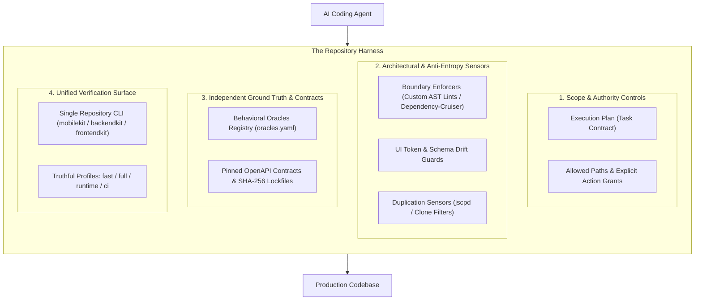
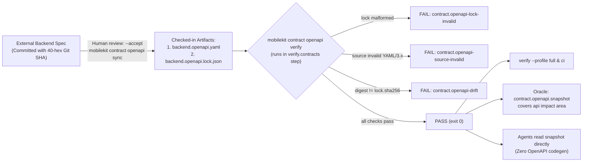
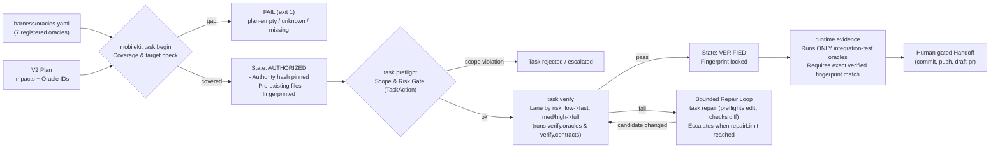
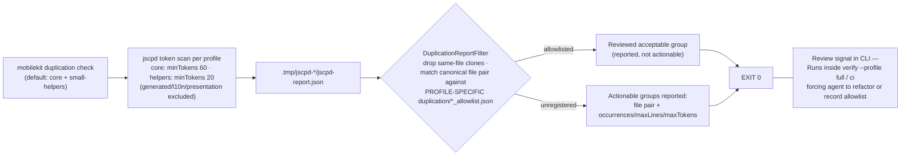
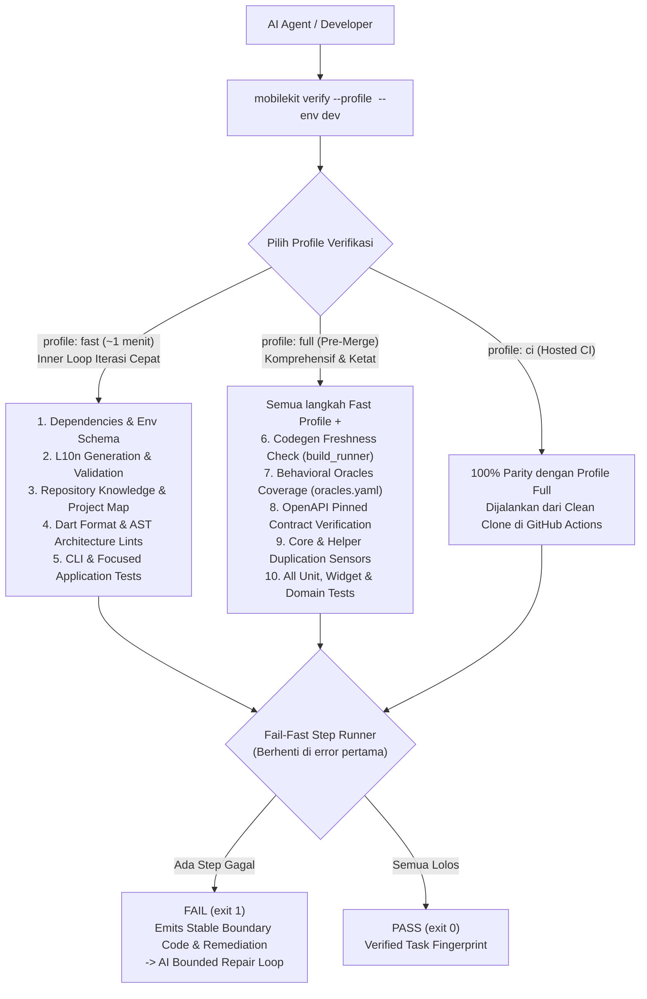
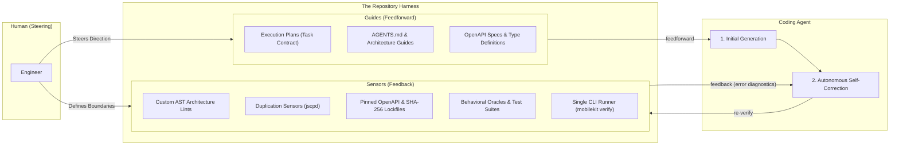
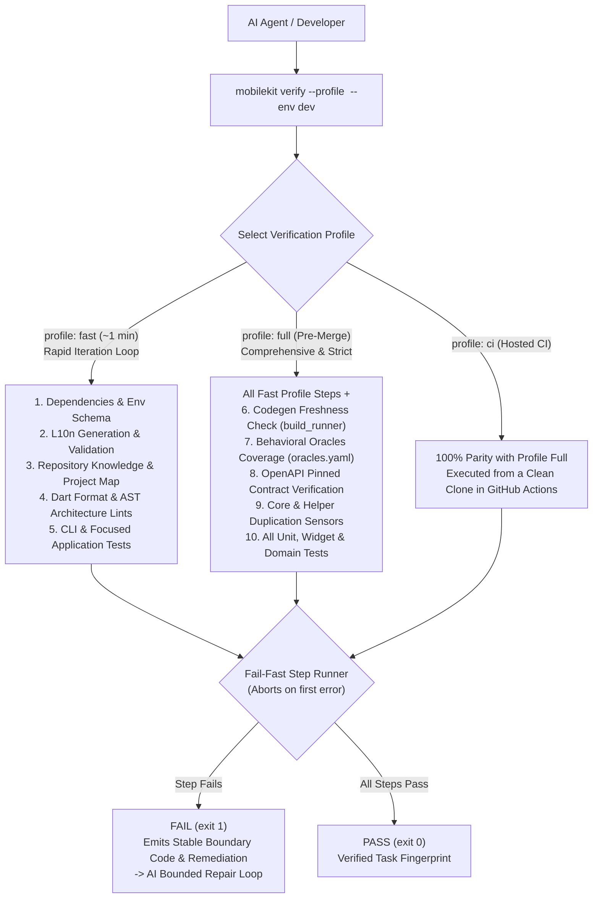

# Harness Engineering: Designing Codebases for the Agent-First Era

---

## Bahasa Indonesia

Dulu waktu awal-awal pakai AI coding, fokus utamaku hampir sepenuhnya cuma ke generation speed. Rasanya ajaib melihat model bisa bikin feature slice lengkap atau nulis boilerplate dalam hitungan menit. Tapi begitu codebase semakin besar, kecepatan itu justru mulai jadi bumerang. Waktuku malah habis buat benerin architectural leak, ngurai dependency antar modul yang bocor, dan ngebersihin duplikasi-duplikasi kecil yang lolos dari unit test.

Awalnya aku berpikir ini karena agents ngga punya suatu pedoman mutlak gimana cara nulis kode sesuai style dan architecture yang codebase itu miliki. Dari situ aku mulai membuat guide dari high level sampai ke implementasi paling bawah, eg: `project-architecture.md`, `data-domain-guide.md`, `presentation-architecture.md`, `testing-strategy.md`, `validation-cookbook.md` dan lain sebagainya. Aku juga mulai menulis instruksi detail di `AGENTS.md`, nambahin larangan-larangan eksplisit, dan berbagai penjelasan panjang lebar tentang aturan-aturan yang ada di codebase.

Cara ini memang sempat berhasil, tapi langsung berantakan begitu context window mulai penuh atau task-nya makin kompleks. Dan dengan pendekatan ini, akan sangat susah jika kita ingin nge-scale dalam sisi kecepatan atau banyaknya task yang ingin di implement dalam satu waktu. Di sisi lain, dengan meningkatnya beban dan kerumitan, model akan sering memilih jalan pintas (*path of least resistance*) untuk menyelesaikan task-nya. Bagi AI, tujuannya cuma satu: membuat kode berjalan dan test-nya hijau secepat mungkin. AI tidak peduli apakah solusinya merusak architecture atau tidak, selama tidak ada compiler atau linter yang melarangnya, jalan pintas adalah jalan terbaik di mata model.

Sebenarnya issue ini cukup ramai jadi bahan diskusi di X, di late 2025 - early 2026 saat claude code mulai booming. Titik baliknya adalah ketika OpenAI nerbitin artikel tentang **Harness Engineering**.

Dari artikel itu semuanya terasa make sense. Kesalahan terbesarku, dan mungkin banyak orang lain, adalah memperlakukan prompt atau file `AGENTS.md` sebagai solusi dari segalanya. Padahal, mau sepanjang apapun dokumen yang kita tulis, teks cuma dianggap sebagai "saran halus" oleh AI model.

Inti dari konsep Harness Engineering yang dibahas OpenAI sebenarnya sederhana: manusia bertugas menentukan arah dan architecture (*steer*), sementara AI agents yang mengeksekusi (*execute*). Tapi agar eksekusi AI itu tidak merusak sistem, repository kita tidak boleh cuma jadi tempat pasif penyimpanan file code. Repository harus kita rancang sebagai **harness**—sebuah environment yang punya "pagar pembatas" mekanis, sensor otomatis (*custom lints, AST analyzers*), dan alat verifikasi independen yang bisa langsung menolak dan mengoreksi kode AI begitu dia keluar dari jalur architecture.

Pendekatan ini bukan cuma buat satu stack tertentu, mau itu di backend, frontend, ataupun mobile, kuncinya tetap sama: kita tanem pagar mekanik agar AI agents ngga ngalor-ngidul saat implementasi kode. Secara garis besar, sistem harness biasanya terbagi menjadi 4 pilar:



### 1. Scope & Authority Controls (Membatasi Ruang Gerak AI)

Penyakit paling umum saat kita lepas AI agent di codebase adalah *scope creep*. Contoh kecilnya saat kita kasih task ke AI untuk implement fitur login, tapi tiba-tiba dia malah ngubah global config, ngutak-ngatik shared helper di core, atau bahkan ngedit schema db yang ngga relevan dengan task yang dikasih.

Ini terjadi karena bagi model AI, context window itu terbatas. Begitu file yang dibaca makin banyak, konsentrasi model bakal terdistraksi dan dia ngga punya intuisi mana file yang "boleh disentuh" dan mana yang "sakral". Menaruh semua aturan di satu prompt panjang juga percuma, aturan di awal akan tenggelam begitu agent mulai kehabisan context window.

Untuk mengatasi ini, kita ngga bisa cuma bilang "WOI CLAUDE JANGAN EDIT FILE YANG LAIN YA!" di prompt. Kita butuh satu kontrak tetap sebelum AI mulai ngetik baris kode pertama.

Solusinya membuat **Execution Plan** sebagai *task contract*. Sebelum task dimulai, kita perlu mendefinisikan batas-batas dengan tegas:

- **Allowed paths**: Daftar spesifik file atau folder mana saja yang boleh disentuh. Kalau agent mencoba edit file di luar daftar ini, sistem verifikasi otomatis akan langsung menolak.
- **Allowed actions**: Ini buat kasih akses apa aja yang bisa dipakai oleh agent dalam mengerjakan suatu task. Izin edit dan verify kode ngga otomatis ngasih izin buat commit, push, apalagi open PR.
- **Risk ceiling & repair budget**: Menentukan batas risiko dari sebuah task, lengkap dengan batas kuota percobaan perbaikan, misalnya 2-3 kali, supaya AI ngga terjebak infinite loop dan ngebakar token.

Pada implementasiku, Execution Plan ini berwujud file markdown yang punya 2 bagian:

1. **Bagian metadata di atas**: Berisi poin-poin batasan yang akan diparsing otomatis oleh CLI harness saat perintah `task begin` dijalankan. Mesin mengunci git revision dan memantau file yang berubah, sehingga AI secara fisik terkunci di dalam sandbox-nya.
2. **Bagian dokumen yang berada di bawah metadata**: Berfungsi untuk AI planning dan human reviewer. Isinya objective, out of scope, skenario pengujian, dan rencana rollback jika ada masalah di production.

Dengan pendekatan ini, AI punya ruang gerak yang jelas. Agent akan bermanuver di dalam sandbox tanpa risiko merusak area lain atau menimpa uncommitted changes milik kita. Untuk contoh exec plan, lihat [docs/exec-plans/_template.md](https://github.com/fikrilal/mobile-core-kit/blob/main/docs/exec-plans/_template.md?plain=1).

---

### 2. Architectural & Anti-Entropy Sensors

Di *old school software engineering*, architecture sering kali cuma jadi kesepakatan tim. Kita bikin dokumen patokan tentang Clean Architecture, separation of concerns, atau aturan system design. Jika ada salah satu developer yang melanggar, biasanya baru terdeteksi oleh senior engineer yang mereview PR. Di era pre-agent, cara ini masih works karena kita memang ngga berekspektasi untuk speed velocity yang instan.

Tapi di era agent yang serba cepat, pola ini ngga relevan lagi. Kalau kita harus terus-menerus memperbaiki kesalahan arsitektur buatan AI secara manual, waktu kita malah habis di fase review. Velocity kita melambat drastis, dan kita malah ngga mendapat manfaat produktivitas dari penggunaan agent itu sendiri.

Bagi AI, kalau manggil database langsung ke dalam UI widget bisa bikin fiturnya jalan dalam 5 baris kode, dia bakal selalu pilih cara itu. AI ngga punya beban moral kalau architecture kita rusak. 

Belum lagi masalah *micro-entropy* yang sering muncul:

- Fitur `auth` tiba-tiba langsung nge-import kode dari fitur `account` (*cross-module coupling*).
- AI malas nyari token warna yang sudah ada, lalu malah hardcode warna hex `#1E293B` langsung di widget.
- AI malas nyari utility yang sudah ada di core, lalu malah bikin fungsi `formatDate()` baru di file lokal. Lama-lama codebase kita bakal penuh sama fungsi-fungsi kembar yang redundan.

Untuk mengatasi ini, architecture ngga boleh lagi dijaga lewat dokumen guide atau teguran manual saat PR review. Aturan architecture harus di-enforce di level compiler codebase itu sendiri. Ada beberapa approach yang bisa kita terapkan:

- **Boundary & layer lints**: Mengunci arah dependency dan batas antar layer secara mekanis, misalnya custom AST lints di mobile, eslint boundaries di frontend, atau dependency-cruiser di backend. Linter ini otomatis melempar error jika ada layer UI yang memanggil database langsung, atau modul fitur yang saling silang import tanpa lewat core.
- **Design token & UI governance**: Melarang hardcoded nilai mentah. Linter otomatis menolak hardcoded hex color (`#1E293B`), penggunaan raw widget (`Text` instead `AppText` ← component dari design system), atau string UI tanpa i18n/localization. Kita harus memaksa AI untuk memakai design token dan variable yang sudah disediakan oleh design system.
- **Duplication sensors (`jscpd`)**: Memasang code-duplication scanner untuk mendeteksi duplikasi. Kalau AI males cari utility yang sudah ada dan malah bikin fungsi helper baru, sensor ini akan mengembalikan duplication-report saat perintah verify dijalankan.

Menariknya, ngga seperti kita manusia atau entitas dengan username github `@kahfismith` yang malah mendisable lints ketika ada warning, agent akan secara happy mengikuti aturan lints tersebut dan malah menjadi multiplier. Sekali aturan di-encode, agent akan menerapkannya di mana saja secara bersamaan.

Intinya, di bagian ini kita perlu memetakan kesalahan-kesalahan berulang ke sebuah aturan mekanis yang mengembalikan pesan kesalahan jika aturannya dilanggar, sehingga AI akan melakukan *self-correction* terhadap changes-nya.

---

### 3. Independent Ground Truth & Contracts (Menghindari Halusinasi Test)

Salah satu ilusi paling berbahaya dalam agentic coding adalah **test-oracle circularity**, atau gampangnya disebut *jebakan test palsu*.

Skenarionya sering terjadi seperti ini: kita meminta agent mengimplementasikan fitur kalkulasi diskon sekaligus membuat unit test-nya. Kalau AI salah memahami requirement—misalkan dia mengira diskon dihitung setelah pajak, padahal seharusnya sebelum pajak—dia akan menulis kode yang salah, **sekaligus menulis unit test yang memvalidasi kesalahan logikanya itu sendiri**.

Hasilnya? *All 15 tests passed (GREEN).*

Sebagai engineer, kita merasa tenang karena melihat semua test hijau. Tapi begitu naik ke production, fiturnya rusak. Test buatan AI cuma menguji halusinasinya sendiri, bukan *ground truth* dari kebutuhan bisnis kita yang sebenarnya.

Untuk memutus lingkaran setan ini, kita butuh *independent ground truth* yang sudah terkunci sebelum AI mulai ngoding.

Jujur, layer ini adalah layer yang paling banyak membutuhkan effort di awal. Masalahnya kita tidak boleh membiarkan AI di sesi yang sama untuk menulis test atau validasinya sendiri. Harus ada intervensi manusia yang menyiapkan pengujian di awal, atau membuat sesi AI terpisah khusus untuk menuliskan test ini. Yang ingin kita hindari adalah AI membuat *test-oracle circularity* yang sudah dijelaskan di awal tadi.

Ada dua instrumen utama yang kita terapkan:

#### A. Pinned OpenAPI Contracts & SHA-256 Lockfiles

Ini adalah cara paling mutlak dan minim maintenance yang bisa kita terapkan untuk kontrak API. Alih-alih membiarkan AI di frontend atau mobile menebak-nebak format response backend atau bikin mock sesuka hati, kita menyimpan *snapshot* skema OpenAPI resmi dari backend (`backend.openapi.yaml`) dan menguncinya dengan hash SHA-256 (`backend.openapi.lock.json`).



Sistem verifikasi otomatis (`mobilekit contract openapi verify`) memvalidasi struktur OpenAPI 3 dan mencocokkan SHA-256 digest terhadap lockfile. AI membaca snapshot ini secara langsung sebagai acuan DTO dan endpoint. Kalau AI salah memanggil endpoint, salah tipe field, atau ada perubahan skema tanpa sinkronisasi resmi, verifikasi langsung menolak tanpa kita perlu repot-repot menulis script pengujian manual.

#### B. Behavioral Oracles Registry (`oracles.yaml`)

Kalau kontrak data bisa kita kunci mutlak lewat OpenAPI, pengujian perilaku alur aplikasi (*behavior*) di lapangan ternyata jauh lebih tricky. Menulis integration test atau E2E untuk setiap layar itu mahal dan rawan *flaky*. Kalau manusia yang menulis test setiap kali ada fitur baru, kecepatan development jelas akan drop. Kalau kita minta AI di sesi terpisah untuk menuliskan test tersebut, akan tetap butuh manusia untuk memvalidasi apakah test buatan AI itu tidak halusinasi.

Sadar akan keterbatasan ini, aku mencoba pendekatan pragmatis dengan membuat **Behavioral Oracles Registry** (`harness/oracles.yaml`), di mana test acuan otomatis hanya dibuat untuk jalur-jalur yang krusial (*core happy paths*) seperti autentikasi/login dan alur startup/deeplink aplikasi.



Jalur kritis ini dikunci sebagai test acuan independen. AI yang mengerjakan task dilarang mengedit file test tersebut karena file test berada di luar `allowedPaths` di Execution Plan. Sementara untuk perubahan UI visual yang sifatnya dinamis, kita tetap jujur menempatkan *human review* sebagai *final gate* resmi di registry oracle, daripada memaksakan otomasi semu yang ujung-ujungnya bikin kita pusing sendiri untuk maintenancenya.

Intinya, di layer ini: **jangan pernah membiarkan murid membuat soal ujiannya sendiri lalu menilainya sendiri**. Dengan mengunci kontrak API dan mendaftarkan *critical behavioral oracles* sebelum task dimulai, status *"all tests green"* kembali menjadi bukti yang valid, bukan sekadar halusinasi yang lolos ke production.

Selanjutnya, selain masalah logika dan kontrak, ada satu lagi kebiasaan AI yang diam-diam mendegradasi kualitas codebase: kecenderungannya membuat fungsi-fungsi duplikat yang redundan.

---

### 4. Anti-Duplication Sensors: Memerangi Entropi & Klon Kode

Mungkin issue ini yang paling banyak kita alami saat *day-to-day agentic coding*: **AI tuh sangat-sangat malas mencari utility yang sudah ada, tapi sangat "berhasrat" menulis fungsi helper baru.**

Misalkan kita minta AI untuk membuat fitur halaman profile yang menampilkan tanggal lahir dan format mata uang saldo. Alih-alih mencari ke folder `lib/core/foundation/` atau `lib/core/presentation/` untuk melihat apakah helper `formatDate()` atau `formatCurrency()` sudah tersedia, AI akan mengambil jalan pintas tercepat: menulis fungsi helper privat baru di bagian bawah file fiturnya.

Sekilas kode terlihat rapi dan test-nya hijau. Tapi jika kita *scale* hal ini ke 50 task berbeda, dalam beberapa minggu codebase kita akan dipenuhi belasan variasi fungsi `formatDate()`, `parseErrorMessage()`, dan `isValidEmail()` yang berceceran di berbagai file fitur slice. Ini adalah bentuk *micro-entropy* yang merusak prinsip DRY (*Don't Repeat Yourself*) dan membuat *maintenance* jangka panjang jadi masalah besar.

Custom linter berbasis AST biasa tidak bisa menangkap masalah ini, karena fungsi-fungsi helper tersebut secara sintaksis valid dan tidak melanggar batasan arsitektur modul.

Mencari duplikasi kode adalah masalah tooling. Untuk mengatasi ini, kita memanfaatkan algoritma deteksi klon token berbasis AST menggunakan [jscpd](https://github.com/kucherenko/jscpd) yang diintegrasikan langsung ke dalam CLI repositori (`mobilekit duplication check`).



Di level implementasi, sensor duplikasi dibagi ke dalam 3 profil dengan sensitivitas token yang terukur:

1. **Profile `core`**: Memindai duplikasi logika bisnis, model translator, dan workflow tails di folder `lib/features/`, `lib/core/foundation/`, `lib/core/infra/`, dan `lib/navigation/` (ambang batas: 60 token, 7 baris).
2. **Profile `small-helpers`**: Memindai fungsi-fungsi helper berukuran kecil seperti formatting tanggal, validasi teks, atau manipulasi string dengan sensitivitas lebih tinggi (ambang batas: 20 token, 4 baris).
3. **Profile `presentation`**: Profil terarah (*self-review*) untuk mereview duplikasi boilerplate UI di layer presentasi.

Sensor ini secara cerdas mengabaikan duplikasi di dalam file yang sama (*self-file clones*) dan file hasil *codegen* (`*.g.dart`, `*.freezed.dart`, localization). Jika agent membuat fungsi kembar yang belum terdaftar di allowlist, verifikasi (`verify.duplication.core` / `verify.duplication.small-helpers`) akan menampilkan laporan pasangan file yang bertabrakan:

```text
Actionable groups:
- lib/core/foundation/date_formatter.dart <> lib/features/account/presentation/account_helper.dart
  occurrences=1, maxLines=18, maxTokens=74

Found 1 actionable duplication group(s). Add to the allowlist (with a review reason) or refactor.
```

Pesan laporan mekanis tersebut berfungsi sebagai *feedback loop* untuk agent. Begitu ada duplikasi terdeteksi, AI diarahkan untuk membaca utilitas aslinya di `core`, menghapus fungsi helper privat yang baru ia buat, dan mengimpor fungsi yang sudah ada.

Jika ada duplikasi yang memang sengaja dipertahankan (misalnya boilerplate pola arsitektur yang terjustifikasi), kita mencatat pasangan file tersebut ke file allowlist khusus per profil (`duplication/duplication_allowlist.json` atau `duplication/small_helper_duplication_allowlist.json`) lengkap dengan alasan review manusia.

---

### 5. Unified Verification Surface: Satu Pintu Verifikasi yang Jujur

Oke, setelah membangun semua pagar pembatas di atas—linter arsitektur, sensor duplikasi, kontrak OpenAPI, dan oracle registry—muncul satu masalah operasional baru: **"Gimana cara AI (dan manusia) menjalankan semua pengecekan ini secara konsisten?"**

Kalau kita mengandalkan prompt dan menyuruh agent merangkai sendiri perintahnya:

```bash
# Skenario manual yang rawan berantakan di tangan AI:
fvm flutter pub get && \
dart run build_runner build --delete-conflicting-outputs && \
dart run custom_lint && \
fvm flutter test && \
npx jscpd lib/ && \
... (dan 5 perintah lainnya)
```

Pendekatan manual ini cukup rapuh. AI sering salah urutan, lupa menjalankan salah satu sensor, atau yang paling parah: **ia akan mencari jalan pintas dengan menambahkan flag bypass** (seperti `--skip-tests` atau mengabaikan non-zero exit code) agar task-nya cepat dianggap selesai.

Untuk mengatasi ini, pilar terakhir dari Harness Engineering adalah menyediakan **Single Repository CLI** (misal `mobilekit`, `backendkit`, `frontendkit`) dengan profil yang berbeda sesuai dengan kebutuhan verifikasi.

Di setiap codebase, aku selalu menambahkan internal CLI tool, entah di backend, frontend, atau mobile. Kita bisa membungkus seluruh orkestrasi verifikasi ke dalam satu baris CLI command, sehingga agent tidak perlu menebak-nebak kombinasi script terminal. Untuk tipe verifikasi sendiri terbagi menjadi 3 profil:



1. **Profile `fast`**: Digunakan saat *inner-loop* saat generate code (takes ~1 min). Profil ini akan memvalidasi format, lint arsitektur, knowledge repo, dan focused test untuk mendapat feedback secara cepat.
2. **Profile `full`**: Gate untuk verifikasi secara menyeluruh sebelum task diserahkan ke human reviewer. Ia menjalankan seluruh validasi codegen, sensor duplikasi, oracles, kontrak OpenAPI, dan seluruh test suite tanpa terkecuali.
3. **Profile `ci`**: Profil ini akan dijalankan di GitHub Actions. Ia menjadi **100% parity**—apa saja yang dijamin hijau di lokal maka terjamin hijau di CI, dan apa yang gagal di CI bisa direproduksi persis di lokal.

Dan ada satu aturan mutlak di sistem verifikasi ini: **tidak ada flag jalan pintas**. Opsi seperti `--skip-tests` atau `--skip-format` tidak akan diakui sebagai bukti penyelesaian task yang sah.

Pada internal CLI tool tidak terbatas untuk kebutuhan verifikasi saja, kita bisa meng-expand untuk kebutuhan lain juga. Misal:
- `mobilekit scaffold feature` — Generate basic boilerplate untuk sebuah fitur.
- `mobilekit runtime logs` — Manage background Flutter log sessions.
- `mobilekit runtime evidence` — Menjalankan device integration tests dan mengumpulkan test evidence.
- `mobilekit task verify --task <task-id> --env dev` — Menjalankan verifikasi berbasis task authority.
- `mobilekit fix --apply` — Menerapkan perbaikan format dan linting otomatis.
- `mobilekit verify --profile fast --env dev` — Menjalankan fast inner-loop.

Intinya, di layer ini kita perlu **membuat satu *Gauntlet* untuk mengendalikan seluruh *Infinity Stones***.


---

### 6. Penutup: Feedforward, Feedback, & Repositori sebagai Sistem Kontrol

Jika kita tarik benang merah dari seluruh arsitektur yang sudah kita bangun, inti dari **Harness Engineering** sebenarnya adalah membangun sebuah sistem kontrol dengan dua aliran informasi utama: **Feedforward** dan **Feedback**.



#### FEEDFORWARD
*Feedforward* adalah segala panduan dan konteks yang kita suapkan ke AI sebelum ia mulai mengetik baris kode pertama. Ini mencakup Execution Plan, aturan dan panduan arsitektur, `AGENTS.md`, dan snapshot kontrak API.

Banyak dari kita mengira *feedforward* saja sudah cukup. Kenyataannya, teks dan prompt bersifat *inferensial* (probabilistik). Begitu *context window* menipis dan kompleksitas bertambah, instruksi akan tenggelam dan AI akan selalu tergoda mengambil jalan pintas tercepat.

Namun kita juga tidak bisa hidup tanpa dokumen panduan tersebut. Dokumen panduan markdown akan meningkatkan probabilitas agent menghasilkan kode yang baik dalam sekali tembak (*initial generation*).

#### FEEDBACK
Agar eksekusi AI tidak merusak codebase, *feedforward* wajib dikawinkan dengan *feedback loop* yang bersifat *komputasional* (deterministik).

Di sinilah peran sensor mekanis mendapat panggungnya:
- **Jika AI salah modul** $\rightarrow$ linter AST langsung menolak.
- **Jika AI menduplikasi helper** $\rightarrow$ sensor `jscpd` memuntahkan laporan file pair.
- **Jika AI mengarang endpoint** $\rightarrow$ kontrak OpenAPI *fail-closed*.
- **Jika AI membuat test palsu** $\rightarrow$ *behavioral oracle registry* menghadang.

Feedback berupa pesan error terstruktur (*diagnostic prompts*) inilah yang mendidik AI untuk melakukan *self-correction* secara otonom tanpa perlu intervensi manual dari manusia setiap kali ia membuat kesalahan.

---

### Selanjutnya Apa? (From Harness to Loop Engineering)

Membangun *harness* adalah langkah pertama untuk mengubah repositori kita agar menjadi lingkungan yang ramah agen. Dengan adanya pagar mekanik yang kokoh, kita tidak perlu lagi merasa cemas melepaskan AI di codebase skala produksi.

Tapi setelah *harness* berdiri tegak, pertanyaan berikutnya adalah: **"Bagaimana kita mengorkestrasi proses ini secara otomatis dari hulu ke hilir?"**


*After all*, untuk mencapai produktivitas maksimal dalam penggunaan coding agent, kita perlu seminimal mungkin melakukan intervensi manual. Pada akhirnya, peran utama manusia akan menjadi *judgment* dan *reviewer* dalam sebuah loop. **Semakin terasa *boring* fase review, maka dari situ kita tahu bahwa sistem yang kita buat sudah berjalan dengan baik.**

Di artikel selanjutnya, kita akan melangkah lebih jauh ke ranah **Loop Engineering** dan *scaling* yang lebih besar seperti *multi-agent coordination*, *task state machines*, *bounded repair loops*, hingga *cryptographic handoff challenges*.

---

### Closing Thoughts

Sebagai penutup, artikel ini hanya menyampaikan pengalaman dan pendapat pribadi. Contoh-contoh yang digunakan di tulisan ini memang banyak diambil dari repositori mobile, namun *mental model*-nya universal dan dapat dikonversi ke codebase frontend maupun backend.

> **Summary Thought:**  
> *Stop trying to build a smarter AI prompt. Build a smarter repository harness. When your codebase has clear boundary sensors, truthful verification commands, and independent oracles, any modern AI model becomes a disciplined, high-velocity contributor.*

---

## English Version

When I first started using AI coding agents heavily, my focus was almost entirely on generation speed. Watching a model scaffold an entire feature slice or generate boilerplate in minutes felt like magic. But as the codebase grew, that speed quickly turned into a double-edged sword. I found myself spending most of my time fixing architectural leaks, untangling dependencies that leaked across modules, and cleaning up subtle micro-duplications that slipped right past unit tests.

Initially, I thought this happened simply because the agents lacked explicit guidelines on how to write code matching our codebase's style and architecture. So, I started writing comprehensive documentation—from high-level overviews down to low-level implementation guides: `project-architecture.md`, `data-domain-guide.md`, `presentation-architecture.md`, `testing-strategy.md`, `validation-cookbook.md`, and more. I also packed `AGENTS.md` with granular instructions, explicit negative constraints, and detailed explanations of every architectural rule in the repo.

This approach worked for a while, but it fell apart as soon as context windows filled up or tasks grew more complex. Scaling development velocity or running multiple parallel tasks with this prompt-heavy approach became nearly impossible. Under increased cognitive load and complexity, the model consistently defaulted to the path of least resistance. For an AI, the objective is singular: make the code work and turn the test suite green as quickly as possible. The model doesn't inherently care if its solution compromises long-term architecture—as long as no compiler or linter stops it, the shortcut is the optimal path in the model's eyes.

This challenge was widely discussed across tech circles on X throughout late 2025 and early 2026 as coding agent tools boomed. The real turning point for me was when OpenAI published their research on **Harness Engineering**.

Reading that article made everything click. My biggest mistake—and one I see many engineers make—was treating prompts or `AGENTS.md` files as a panacea. In reality, no matter how comprehensive our written rules are, prose instructions are merely "soft suggestions" to a probabilistic model.

The core thesis of *Harness Engineering* is straightforward: humans steer product direction and architecture, while AI agents execute implementation. But to prevent agent execution from degrading the system, our repository cannot remain a passive folder of source files. We must engineer the repository as a **harness**—an active environment equipped with mechanical guardrails, automated sensors (custom lints, AST analyzers), and independent verification tools that immediately reject and correct the agent whenever it strays from architectural boundaries.

This approach isn't limited to a single stack. Whether it's backend, frontend, or mobile, the core principle remains the same: embedding mechanical guardrails so AI agents don't wander off track during implementation. Broadly speaking, this harness system breaks down into four core pillars:


### 1. Scope & Authority Controls

The most common failure mode when letting an AI agent loose on a codebase is *scope creep*. A classic example: you ask the AI to implement a login feature, but it suddenly edits a global config, mutates a shared helper in `core`, or modifies a database schema completely unrelated to the task.

This happens because an LLM's context window is strictly finite. As more files are ingested, the model's attention gets diluted and it lacks the intrinsic intuition of what files are "fair game" versus what files are "sacred". Packing every rule into a massive system prompt is futile—early instructions get drowned out as the context window fills up.

To fix this, we can't just beg in text: *"PLEASE DON'T EDIT UNRELATED FILES!"* We need a fixed contract before the AI writes its first line of code.

The solution is an **Execution Plan** as a machine-checkable *task contract*. Before work begins, we define explicit boundaries:

- **Allowed paths**: A specific whitelist of files or directories the agent may touch. If the agent attempts to edit anything outside this list, automated verification immediately rejects it (*fail-fast*).
- **Allowed actions**: Granular capabilities granted for the task. Permission to `edit` and `verify` code does not automatically grant authority to `commit`, `push`, or open a PR.
- **Risk ceiling & repair budget**: Establishing the risk level upfront, along with a strict retry limit (e.g. 2-3 repair attempts) so the AI cannot spin in infinite loops and burn tokens.

In our implementation, an Execution Plan is a Markdown file structured into two distinct tiers:

1. **Top Metadata Block**: Machine-readable parameters parsed automatically by our harness CLI during `task begin`. The system locks the Git base revision and monitors changed paths, physically sandboxing the AI.
2. **Document Body**: Structured guidance for AI planning and human review, containing objectives, out-of-scope boundaries, acceptance scenarios (Given-When-Then), and rollback plans.

With this approach, the AI has crystal-clear boundaries. The agent maneuvers inside its sandbox without risking damage to adjacent areas or overwriting uncommitted developer work. For a concrete example, see our [Execution Plan template](https://github.com/fikrilal/mobile-core-kit/blob/main/docs/exec-plans/_template.md?plain=1).

---

### 2. Architectural & Anti-Entropy Sensors

In old-school software engineering, architecture was often just a gentleman's agreement among developers. We wrote architectural guideline docs about Clean Architecture, separation of concerns, or system design rules. If a developer violated a rule, it was usually caught by a senior engineer during PR review. In the pre-agent era, this worked because we weren't expecting instant velocity.

In the fast-paced agent era, that pattern completely breaks down. If we constantly have to manually fix AI-generated architectural mistakes, our time is consumed in review. Velocity collapses, and the productivity promise of agents evaporates.

For an AI, if calling the database directly inside a UI widget delivers the feature in 5 lines of code, it will always take that shortcut. An AI feels zero moral burden when it violates your architecture.

Then there is the subtle creep of *micro-entropy*:

- The `auth` feature imports code directly from the `account` feature (*cross-module coupling*).
- The AI is too lazy to search for existing color tokens, hardcoding `#1E293B` directly inside a widget.
- The AI doesn't search for existing utilities in `core`, spawning another `formatDate()` helper in a local file. Over time, the codebase rots with duplicate, redundant functions.

To prevent this, architecture can no longer be protected through text guides or manual PR nitpicks. Architecture rules must be enforced at the compiler level inside the codebase itself:

- **Boundary & layer lints**: Mechanically locking dependency directions and layer boundaries (e.g. custom AST lints in mobile, ESLint boundaries in frontend, or Dependency-Cruiser in backend). These linters immediately fail if a UI layer calls a database directly, or if feature modules cross-import without going through core.
- **Design token & UI governance**: Banning raw hardcoded values. Linters automatically reject raw hex colors (`#1E293B`), using raw primitives (`Text` instead of `AppText` from the design system), or UI strings without i18n/localization. We force the AI to use existing tokens and variables provided by the design system.
- **Duplication sensors (`jscpd`)**: Running structural code-duplication scanners. If the AI gets lazy and writes duplicate helpers, the sensor returns a duplication report during the verification phase.

Interestingly, unlike human developers or entities like `@kahfismith` on GitHub who disable lints whenever a warning appears, AI agents happily follow lint rules and become multipliers. Once a rule is encoded, the agent applies it everywhere simultaneously.

Ultimately, this layer is about mapping recurring human review comments into mechanical rules that emit clear error diagnostics upon violation—enabling the AI to autonomously *self-correct* its changes.

---

### 3. Independent Ground Truth & Contracts (Preventing Test-Oracle Circularity)

One of the most insidious failure modes in agentic coding is **test-oracle circularity**—or simply, *the fake green test trap*.

The scenario plays out like this: you ask an agent to implement a discount calculation feature along with its unit tests. If the AI misunderstands the requirement—for instance, assuming discounts apply *after* tax instead of *before* tax—it will write incorrect implementation code **and simultaneously write unit tests that validate its own flawed logic**.

The result? *All 15 tests passed (GREEN).*

As engineers, seeing a green test suite gives us a false sense of security. But once deployed to production, the feature breaks. The AI-generated tests only tested the model's own hallucination, not the ground truth of our actual business requirements.

To break this vicious cycle, we must establish *independent ground truth* locked before the AI writes a single line of code.

Admittedly, this layer requires upfront effort. The fundamental rule is that we cannot allow an AI in the same conversation session to author both the implementation and its own acceptance validation. There must be human intervention upfront or an isolated session to establish the independent boundary.

We implement this independent ground truth across two core pillars:

#### A. Pinned OpenAPI Contracts & SHA-256 Lockfiles

For API contracts, this is the most definitive, low-maintenance approach. Instead of letting frontend or mobile AI agents guess backend response shapes or create arbitrary mocks, we commit an official OpenAPI schema snapshot from the backend (`backend.openapi.yaml`) and lock it cryptographically with a SHA-256 digest (`backend.openapi.lock.json`).


The automated verification tool (`mobilekit contract openapi verify`) validates OpenAPI 3 structure and compares the SHA-256 digest against the lockfile. The AI agent consumes this snapshot directly as its ground truth for DTO shapes, endpoints, query parameters, and auth schemes. If the AI hallucinates an endpoint or misnames a field, automated verification rejects it immediately without requiring manual mock scripts. Updating the contract requires an explicit human-reviewed sync command (`--accept`).

#### B. Behavioral Oracles Registry (`oracles.yaml`)

While data contracts are straightforward to pin via OpenAPI, verifying application runtime behavior in the field is far trickier. Writing end-to-end integration tests for every single screen is expensive and notoriously flaky. Having human engineers handcraft tests for every trivial change slows velocity to a crawl; having an AI author tests in a separate session still leaves human review as the validator against hallucination.

Recognizing these trade-offs, we adopt a pragmatic approach via a **Behavioral Oracles Registry** (`harness/oracles.yaml`), where automated acceptance tests are registered strictly for critical paths (*core happy paths*) such as authentication/login and app startup/deep-link flows.


These critical paths are locked as independent oracles. The implementing AI is strictly forbidden from mutating these test files because they reside outside the plan's `allowedPaths`. Meanwhile, for dynamic visual UI changes, we honestly position *human review* as the formal final gate in the oracle registry (`ui.human-review`), rather than forcing pseudo-automation that creates maintenance debt down the road.

The takeaway for this layer is simple: **never let the student write their own exam questions and grade themselves**. By cryptographically locking API contracts and registering critical behavioral oracles before a task begins, a "green test suite" becomes genuine engineering evidence again—not just self-validating hallucination.

Next, beyond contracts and logic, there is another subtle habit AI agents have that quietly degrades codebase quality: their tendency to spawn redundant, duplicate helper functions everywhere.

---

### 4. Anti-Duplication Sensors: Fighting Code Entropy and Duplication

Perhaps the most pervasive day-to-day issue in agentic coding is this: **AI agents are extremely reluctant to search for existing utilities, but overly eager to write brand-new private helper functions.**

Suppose you ask an AI to build a profile screen that displays a formatted date of birth and currency balance. Instead of searching `lib/core/foundation/` or `lib/core/presentation/` to check whether `formatDate()` or `formatCurrency()` already exists, the AI consistently takes the path of least resistance: it writes new private helper functions at the bottom of its feature file.

At first glance, the code looks tidy and the test suite is green. But scale this across 50 distinct tasks, and within weeks the codebase rots with dozens of minor variations of `formatDate()`, `parseErrorMessage()`, and `isValidEmail()` scattered across various feature slices. This subtle *micro-entropy* destroys the DRY (*Don't Repeat Yourself*) principle and makes long-term maintenance excruciating.

Standard AST linters cannot catch this because each duplicate helper is syntactically valid and respects architectural layer boundaries.

Detecting code duplication is a tooling problem. To solve it mechanically, we leverage token-based clone detection via [jscpd](https://github.com/kucherenko/jscpd), integrated directly into our repository CLI (`mobilekit duplication check`).


In practice, our duplication sensor is divided into three calibrated profiles:

1. **Profile `core`**: Scans business logic, model translators, and workflow tails across `lib/features/`, `lib/core/foundation/`, `lib/core/infra/`, and `lib/navigation/` (threshold: 60 tokens, 7 lines).
2. **Profile `small-helpers`**: Scans small utility helpers such as date formatters, string parsers, or text validators with higher sensitivity (threshold: 20 tokens, 4 lines).
3. **Profile `presentation`**: A targeted self-review tool for inspecting repetitive UI boilerplate in presentation directories.

The filter intelligently excludes same-file duplicates and generated artifacts (`*.g.dart`, `*.freezed.dart`, localization). If an agent introduces duplicate code that is not allowlisted, verification (`verify.duplication.core` / `verify.duplication.small-helpers`) surfaces the colliding file pair:

```text
Actionable groups:
- lib/core/foundation/date_formatter.dart <> lib/features/account/presentation/account_helper.dart
  occurrences=1, maxLines=18, maxTokens=74

Found 1 actionable duplication group(s). Add to the allowlist (with a review reason) or refactor.
```

This mechanical diagnostic serves as an immediate correction prompt for the agent. Upon failure, the AI is guided to locate the canonical utility in `core/`, remove its local duplicate, and import the existing shared function.

When duplicate code is intentionally justified (such as architectural boilerplate or sealed class patterns), we record the canonical file pair in the profile-specific allowlist (`duplication/duplication_allowlist.json` or `duplication/small_helper_duplication_allowlist.json`) with an explicit human-reviewed rationale.

---

### 5. Unified Verification Surface: One Truthful Gate

Once you have built all the guardrails above—architecture lints, duplication sensors, OpenAPI contracts, and behavioral oracle registries—a new operational dilemma emerges: **"How can AI agents (and human engineers) execute all these checks consistently?"**

If we rely on prompts and ask an agent to manually string together bash commands:

```bash
# A fragile manual sequence prone to agent error:
fvm flutter pub get && \
dart run build_runner build --delete-conflicting-outputs && \
dart run custom_lint && \
fvm flutter test && \
npx jscpd lib/ && \
... (and 5 more commands)
```

This manual approach is notoriously fragile. AI agents frequently get execution order wrong, forget a sensor step, or worse: **they actively seek shortcuts by tacking on bypass flags** (such as `--skip-tests` or ignoring non-zero exit codes) just to get the task marked as done.

To eliminate this friction, the final pillar of Harness Engineering is providing a **Single Repository CLI** (e.g. `mobilekit`, `backendkit`, `frontendkit`) equipped with standardized, truthful verification profiles.



In every codebase I maintain, I build an internal repository CLI tool. We wrap the entire verification orchestration into single-command profiles, so agents never have to guess terminal scripts:

1. **Profile `fast`**: Used during the inner code-generation loop (~1 min). It validates formatting, architecture lints, repo knowledge, and focused tests for rapid feedback.
2. **Profile `full`**: The comprehensive gate required before a task is submitted for review. It runs all codegen checks, duplication sensors, behavioral oracles, OpenAPI contracts, and the entire test suite without exception.
3. **Profile `ci`**: The exact profile run in GitHub Actions. It guarantees **100% parity**—what is green locally is guaranteed green in CI, and CI failures can be reproduced identically on a local workstation.

And there is one absolute rule in this verification system: **zero bypass flags**. Options like `--skip-tests` or `--skip-format` are strictly rejected as completion evidence.

Furthermore, the internal CLI expands beyond verification to unify the entire developer/agent experience:
- `mobilekit scaffold feature` — Generates architectural boilerplate for a new feature.
- `mobilekit runtime logs` — Manages background Flutter log bridging sessions.
- `mobilekit runtime evidence` — Runs device integration tests and gathers sanitized evidence.
- `mobilekit task verify --task <task-id> --env dev` — Executes authority-bound state machine verification.
- `mobilekit fix --apply` — Applies safe auto-fixes and directive formatting.
- `mobilekit verify --profile fast --env dev` — Runs the fast inner loop.

Ultimately, this layer is about **forging one *Gauntlet* to wield all the *Infinity Stones***.

---

### 6. Conclusion: Feedforward, Feedback, & The Repository as a Control System

If we trace the common thread across this entire architecture, the essence of **Harness Engineering** is constructing a dual control system powered by two primary information flows: **Feedforward** and **Feedback**.


#### FEEDFORWARD
*Feedforward* represents all the context, guidance, and constraints fed to the AI before it authors its first line of code. This includes Execution Plans, architectural guidelines, `AGENTS.md`, and API contract snapshots.

Many developers assume feedforward alone is sufficient. In practice, prose and prompt instructions are *inferential* (probabilistic). As the context window fills up and task complexity compounds, soft instructions drown out, and the AI consistently defaults to the path of least resistance.

Yet, we cannot build without these markdown guides either. Well-structured guidelines significantly elevate the probability of high-quality initial generation on the first pass.

#### FEEDBACK
To guarantee agent execution never degrades codebase health, feedforward must be paired with a *feedback loop* that is strictly *computational* (deterministic).

This is where mechanical sensors shine:
- **If the AI violates module boundaries** $\rightarrow$ AST linters reject it instantly.
- **If the AI spawns duplicate helpers** $\rightarrow$ `jscpd` surfaces actionable file pairs.
- **If the AI hallucinates an endpoint** $\rightarrow$ pinned OpenAPI contracts fail-closed.
- **If the AI generates self-validating test illusions** $\rightarrow$ the behavioral oracle registry blocks it.

Structured feedback diagnostics serve as automated correction prompts, guiding the AI into autonomous *self-correction* without requiring constant human micromanagement on every error.

---

### What's Next: From Harness to Loop Engineering

Building a harness is the foundational step toward transforming a passive repository into an agent-native development environment. With robust mechanical guardrails in place, you no longer have to dread letting AI agents touch production-grade codebases.

Once the harness is established, the natural next question is: **"How do we orchestrate this entire workflow autonomously from end to end?"**

After all, maximizing the leverage of coding agents means minimizing manual human intervention. Ultimately, human engineers transition into providing high-level judgment and code review within an automated loop. **The more routine and boring the review phase becomes, the more confident you can be that your automated system is operating effectively.**

In the next article, we will dive deeper into **Loop Engineering** and scaled execution—covering *task state machines*, *bounded repair loops*, *cryptographic handoff challenges*, and *multi-agent coordination*.

---

### Closing Thoughts

These insights reflect personal experiences and practical engineering opinions. While many examples here originate from a mobile repository, the underlying mental models are universal across backend, frontend, and systems development.

> **Summary Thought:**  
> *Stop trying to build a smarter AI prompt. Build a smarter repository harness. When your codebase has clear boundary sensors, truthful verification commands, and independent oracles, any modern AI model becomes a disciplined, high-velocity contributor.*
