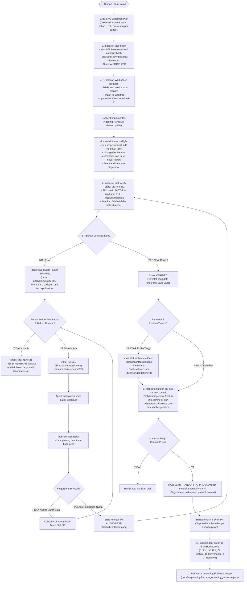

# Full Flow: Harness & Controlled Engineering Loop

Dokumen ini memetakan seluruh alur kerja (*end-to-end lifecycle*) dari sistem Harness dan Loop Engineering di repositori `mobile-core-kit`.

---

## 1. Diagram Alur Lengkap (End-to-End Flowchart)



---

## 2. Penjelasan 11 Tahapan Sistem

### 1. Task Intake & V2 Execution Plan (Kontrak Otoritas)
Sebelum menulis kode, dibuat dokumen rencana kerja di `docs/exec-plans/active/<plan>.md`. Dokumen ini bukan sekadar catatan, melainkan **kontrak otoritas yang dibaca mesin**:
- **Allowed Paths**: Daftar file/folder yang boleh diedit (menolak wildcard `*` atau akses root).
- **Allowed Actions**: Hak akses terpisah (`edit`, `verify`, `commit`, `push`, `draft-pr`). Izin mengedit tidak otomatis memberi izin commit atau push.
- **Risk & Ceiling**: Level risiko deklarasi dan batas atas risiko maksimal.
- **Behavioral Oracle IDs**: Tes acuan yang sudah terdaftar di `harness/oracles.yaml`.
- **Repair Limit & Timeout**: Batas percobaan perbaikan (misal: 3 kali) dan batas waktu (misal: 1800 detik).

---

### 2. Kunci Baseline (`mobilekit task begin`)
Perintah ini membaca Execution Plan, mengunci commit base Git saat ini, menghitung `authorityHash`, dan mem-fingerprint file-file yang sedang *dirty/uncommitted* milik developer agar tidak tertimpa AI. State task berubah menjadi `AUTHORIZED`.

```bash
dart run mobile_core_kit_cli:mobilekit task begin \
  --plan docs/exec-plans/active/<plan-path>.md
```

---

### 3. Isolasi Workspace (`mobilekit task workspace prepare`)
Menyiapkan Git worktree terpisah di `.tmp/mobilekit/worktrees/<task-id>` pada branch `agent/<task-id>`. AI bekerja di direktori terisolasi ini sehingga pekerjaan developer di repositori utama tetap aman.

```bash
dart run mobile_core_kit_cli:mobilekit task workspace prepare \
  --task <task-id>
```

---

### 4. Agent Mengimplementasikan Kode
AI menulis kode, membuat test, atau mengupdate dokumen **hanya** di dalam `allowedPaths` yang sudah disetujui.

---

### 5. Preflight Pengecekan (`mobilekit task preflight`)
Sebelum aksi dijalankan, sistem mengecek:
- Apakah ada file yang diedit di luar `allowedPaths`?
- `RiskClassifier` otomatis menghitung risiko file yang diubah (otomasi boleh menaikkan risiko, tapi dilarang menurunkan risiko yang sudah diset manusia).
- Menghitung `taskFingerprint` (SHA-256 dari authority + base commit + isi file yang diubah).

```bash
dart run mobile_core_kit_cli:mobilekit task preflight \
  --task <task-id> --action verify
```

---

### 6. Verifikasi Terkendali (`mobilekit task verify`)
State berubah jadi `VERIFYING`. Sistem otomatis memilih profil verifikasi:
- **Low Risk** → Profile `fast` (lint, format, schema, test harness ~1 menit).
- **Medium / High Risk** → Profile `full` (codegen freshness, oracles, kontrak OpenAPI, sensor duplikasi, semua unit & widget test).

```bash
dart run mobile_core_kit_cli:mobilekit task verify \
  --task <task-id> --env dev
```

---

### 7. Percabangan Hasil Verifikasi (Gagal vs Lolos)

#### Cabang Gagal (Exit Code != 0 atau Timeout):
1. Sistem mengelompokkan error ke dalam *Stable Failure Boundary* (`analysis.custom_lint`, `codegen.drift`, `format.dart`, `duplication.core`, dll).
2. Menyensor pesan error dari token, password, atau PII.
3. Mengecek sisa kuota perbaikan (*repair budget*) dan timeout:
   - **Jika kuota habis / timeout** → State berubah jadi **`ESCALATED`**. AI dihentikan total dan wajib lapor manusia.
   - **Jika kuota masih ada** → State jadi **`FAILED`**.
4. AI memperbaiki kode dengan tool biasa.
5. AI menjalankan `mobilekit task repair`.
6. Sistem mengecek: **Apakah candidate fingerprint berubah?**
   - *Kode sama saja (AI bingung)* → Kuota repair berkurang 1, state tetap `FAILED`.
   - *Kode berubah nyata* → State kembali jadi **`AUTHORIZED`**, AI boleh mencoba `verify` lagi.

```bash
dart run mobile_core_kit_cli:mobilekit task repair \
  --task <task-id>
```

#### Cabang Lolos (Exit Code == 0):
State berubah jadi **`VERIFIED`**. Fingerprint candidate dikunci.

---

### 8. Pengumpulan Bukti Runtime Mobile (`mobilekit runtime evidence`)
Untuk perubahan risiko tinggi (auth, session, startup, platform), unit test statis belum cukup membuktikan aplikasi berjalan dengan benar di device. Sistem menjalankan integration test di emulator/device sungguhan dan menghasilkan `evidence.json` yang tersensor rapi.

```bash
dart run mobile_core_kit_cli:mobilekit runtime evidence \
  --task <task-id> --device <device-id> --flavor dev
```

---

### 9. Verified Handoff (Gerbang Persetujuan Manusia)
Status `VERIFIED` artinya hanya **siap direview**, bukan izin rilis. 
1. `mobilekit handoff dry-run` memvalidasi candidate dan menghasilkan token *challenge* 15 menit.
2. Mutasi Git/GitHub hanya bisa jalan jika manusia memberikan izin dan token tersebut disuntikkan:

```bash
MOBILEKIT_HANDOFF_APPROVAL=<challenge-token> \
  dart run mobile_core_kit_cli:mobilekit handoff commit \
  --task <task-id> --message "feat(auth): refresh token handler"

MOBILEKIT_HANDOFF_APPROVAL=<challenge-token> \
  dart run mobile_core_kit_cli:mobilekit handoff push \
  --task <task-id>

MOBILEKIT_HANDOFF_APPROVAL=<challenge-token> \
  dart run mobile_core_kit_cli:mobilekit handoff draft-pr \
  --task <task-id> --base main --title "..."
```

---

### 10. Clean Hosted CI di GitHub Actions
CI di GitHub (`.github/workflows/required.yml`) menjalankan verifikasi independen dari *clean checkout*:
- `CI Risk` (reclassifies clean base/head diff & plan).
- `CI Full` (runs canonical `mobilekit verify --profile ci`).
- `CI Runtime` (runs goldens and Android build if runtime required).
- `CI Governance` (dependency review & Gitleaks secret scan).
- `CI Required` (aggregate status gate).

---

### 11. Pencatatan Evidence & Continuous Learning
Task yang selesai direkam ke ledger `docs/engineering/harness_operating_evidence.json` untuk evaluasi performa harness jangka panjang.
