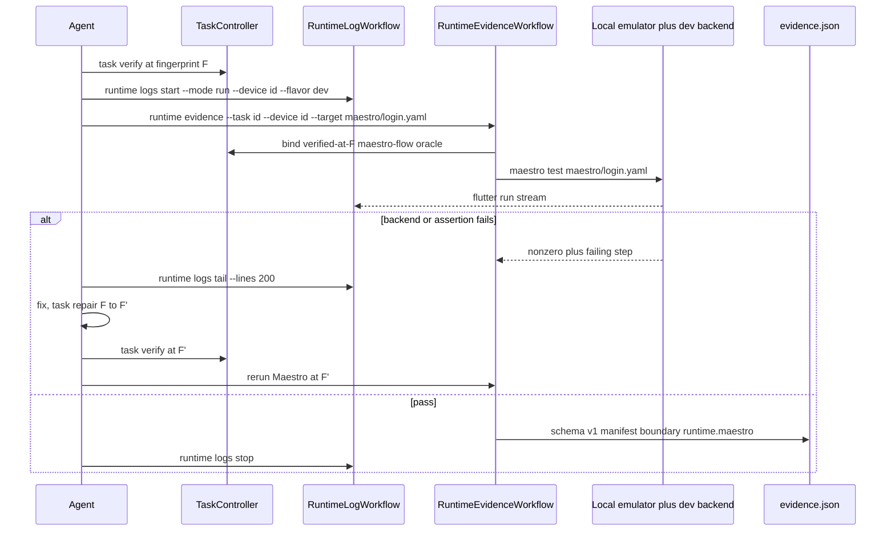

# Local Agent Journey Proof with Maestro

Status: proposed. Decision input, not authority. Does not authorize
implementation, commit, or publication.
Date: 2026-09-06. Rewritten 2026-09-08.
Location: `_WIP/`

Related:
- `_WIP/2026-09-06_harness-loop-rating-gaps.md` (gap 4)
- `docs/engineering/mobile_runtime_harness.md`
- `docs/engineering/behavioral_oracles.md`
- `docs/engineering/agent_pr_loop.md`
- `docs/engineering/testing_strategy.md`
- `harness/oracles.yaml`

## Recommendation

Adopt Maestro as a **local agent verification** sensor.

After static `task verify`, the implementing agent proves the user journey by
driving the real app on a **local emulator** against the real dev backend.
Proof is unit/bloc tests plus a Maestro exit bound to the task fingerprint.
Logs stay the existing `mobilekit runtime logs` session.

Do not put Maestro in hosted CI, Maestro Cloud, nightly farms, or
`verify --profile full`. Keep `integration_test` for deep wiring. Do not
widen Dart fake-stacks as journey proof.

This proposal replaces the earlier CI/nightly-oriented draft in this file.
The change is the product: agent journey proof, not a hosted device gate.

## Current behavior

`mobilekit runtime evidence` already exists
(`RuntimeEvidenceWorkflow`). After `task verify` at fingerprint F it:

1. Resolves binding in `TaskRuntimeEvidenceBindingResolver` (verified
   lifecycle, fingerprint match, at least one `integration-test` oracle).
2. Runs `flutter test -d <device> --flavor <flavor> <target>` per selected
   target.
3. Writes `_artifacts/mobile/<ts>/evidence.json` + `summary.md` (schema v1).
   Boundary today: `runtime.integration`.

`handoff check` treats `integration-test` as satisfied only when a matching
`evidence.json` records `oracleId:target` passed
(`CompletionEvidenceReader`). Other kinds fall through to
`manual-evidence.json`.

What that proves today is wiring, not a user journey:

- Registered device oracles are only `auth.integration` and
  `startup.integration`.
- `integration_test/auth_happy_path_test.dart` injects
  `_FakeAuthRepository`, `_InMemorySessionRepository`, and marker HOME
  pages, then drives `WidgetTester`.
- Hosted `CI Runtime` copies `.env/dev.example.yaml` and
  `harness/fixtures/google-services.ci.json`, then reruns those same
  tests. `_artifacts/*` is gitignored.
- `mobilekit runtime logs` (`start --mode run|logs`, `tail`, `stop`)
  already streams `flutter run` into
  `_artifacts/runtime_logs/<session>/stream.log`. That session is
  diagnostic. It is not completion evidence.

A separate live Dart test exists:
`integration_test/merchant_onboarding_live_test.dart` hits a real backend
behind `LIVE_E2E=1`, with unique emails and production DI, plus a launch
override. It is not a registered oracle, not in `CI Runtime`, and it is
still a Dart test harness, not the shipped APK a user taps.

So an agent can implement login (API, mapper, cubit, page), pass unit
tests, and never tap the real app.

## Proposed behavior

Agent loop for a user-facing flow:

```text
implement (API, mapper, UI state, page)
  → mobilekit task verify          # unit / bloc / lint / full lane
  → runtime logs start --mode run  # real APK, local emulator (exists)
  → runtime evidence --target maestro/<flow>.yaml
  → fail → runtime logs tail → task repair → re-verify → rerun Maestro
```

| Today | Proposed |
|---|---|
| Journey proof = fake `integration_test` or `human:<id>` | Journey proof = Maestro on real APK + real dev backend |
| `runtime evidence` runs only `integration-test` | Same command also runs `maestro-flow` targets |
| Logs exist, not attached to completion | Logs stay diagnostic; Maestro exit is the proof |
| `handoff check` ignores unregistered YAML | Only kit-CLI Maestro runs satisfy `maestro-flow` |
| CI Runtime reruns fakes | Unchanged. Maestro is not a CI lane |

Raw `maestro test` and Maestro MCP remain iteration tools. They never
satisfy `handoff check`.

## Final interface

Three surfaces exist. Only one is harness completion.

```text
                    ┌─────────────────────────────────────┐
  OPTIONAL          │ Maestro MCP  (`maestro mcp`)        │
  iteration         │ inspect_screen / run / screenshot   │
  not proof         │ writes or debugs YAML, never binds  │
                    └─────────────────────────────────────┘
                                      │
                    ┌─────────────────────────────────────┐
  OPTIONAL          │ Maestro CLI  (`maestro test …`)     │
  iteration         │ same YAML, no task fingerprint      │
  not proof         └─────────────────────────────────────┘
                                      │
                    ┌─────────────────────────────────────┐
  REQUIRED          │ mobilekit CLI                       │
  proof             │ task verify                         │
                    │ runtime logs start --mode run       │  (exists)
                    │ runtime evidence --target maestro/… │  (extend)
                    │ handoff check                       │  (extend)
                    └─────────────────────────────────────┘
                                      │
                               shells out to
                          `maestro test maestro/<flow>.yaml`
                          on the already-running emulator
```

**Completion command (the interface agents must use when claiming done):**

```bash
dart run mobile_core_kit_cli:mobilekit task verify --task <id> --env dev

dart run mobile_core_kit_cli:mobilekit runtime logs start \
  --session journey --mode run --device <emulator-id> --flavor dev \
  --target lib/main_dev.dart

dart run mobile_core_kit_cli:mobilekit runtime evidence \
  --task <id> --device <emulator-id> --flavor dev \
  --target maestro/login.yaml

dart run mobile_core_kit_cli:mobilekit runtime logs tail \
  --session journey --lines 200

dart run mobile_core_kit_cli:mobilekit handoff check --task <id>
```

`runtime evidence` is the only command that may write a Maestro
`evidence.json` `handoff check` will accept. It already exists for
`integration-test`. This work extends it so `--target maestro/*.yaml`
is legal when that path is a selected `maestro-flow` oracle.

**Iteration (allowed, never completion):**

```bash
maestro test maestro/login.yaml
# or agent tools from `maestro mcp`: inspect_screen, run, take_screenshot
```

MCP ships inside the Maestro CLI (`claude mcp add maestro -- maestro mcp`).
This repository does not wrap MCP, does not add a Maestro MCP server of
its own, and does not treat MCP `run` as evidence. MCP is how an agent
authors and debugs YAML. `mobilekit` is how it proves the YAML.

Do not add `mobilekit maestro …`. One evidence command, two oracle kinds.

## Requirements

### Machine (local developer / agent host)

| Need | Who provides it | Required for |
|---|---|---|
| Maestro CLI on `PATH` (`maestro test` works) | Human installs once (`curl` installer or package). Not a Dart pub dependency. | Iteration and proof. Proof fails closed if the binary is missing. |
| Android emulator (or later iOS simulator) + ADB | Existing Flutter/Android SDK | Running the app and Maestro |
| Reachable local/dev backend + real `.env/dev.yaml` + real `google-services.json` | Existing env. No example-env fallback for `maestro-flow`. | Real journey. Fail closed if down. |
| `mobilekit` (already in repo) | `packages/mobile_core_kit_cli` | Binding, logs, evidence, handoff |
| Maestro MCP | Optional agent config. Same CLI binary, `maestro mcp`. | Authoring YAML faster. Not proof. Not installed by `mobilekit`. |
| Maestro Cloud / hosted MCP | Forbidden | — |

`mobilekit doctor` should report whether `maestro` is on `PATH`. That is
a diagnostic, not completion evidence.

### Repository engineering (what we actually build)

Harness-only except Semantics on widgets a flow must tap.

1. **Oracle kind** `maestro-flow` in `OracleRegistry._oracleKinds`.
   Targets are repo-relative `maestro/<flow>.yaml`. `oracle verify`
   checks the file exists.
2. **Pilot flow** `maestro/login.yaml` plus a registered oracle id
   (e.g. `auth.journey`) covering impact `auth` / `ui`.
3. **Binding** (`TaskRuntimeEvidenceBindingResolver`): collect
   `maestro-flow` as well as `integration-test`. Empty of both still
   fails `runtime.oracle-missing`.
4. **Runner** (`RuntimeEvidenceWorkflow`): if selected target is
   `maestro-flow`, invoke `maestro test <yaml>` on `--device`, do not
   run `flutter test`. Capture exit + failing step. `boundary`:
   `runtime.maestro`. Reject `--flavor prod`.
5. **Logs**: reuse `RuntimeLogWorkflow`. Do not start a second log
   stack. Do not parse `stream.log` into the manifest.
6. **Completion** (`CompletionEvidenceReader`): `maestro-flow` uses
   the same runtime-manifest match as `integration-test`. Must not
   fall through to `manual-evidence.json`.
7. **CLI tests** for: unknown kind, missing binary, unregistered
   target, unverified fingerprint, `prod` rejected, handoff latest-wins.
8. **Docs** in the same task: `mobile_runtime_harness.md`,
   `behavioral_oracles.md`, `mobilekit_cli_reference.md`,
   `testing_strategy.md`.
9. **Not built:** Maestro Cloud client, MCP wrapper, new
   `mobilekit maestro` command, CI job, Dart fake-stack for login.

### Agent (operating contract, later in AGENTS.md / agent_pr_loop.md)

After implementing a user-facing flow:

1. `task verify` (units + static).
2. Start the real app with `runtime logs start --mode run`.
3. Iterate with MCP or `maestro test` if useful.
4. Claim journey proof only via `runtime evidence --target maestro/…`.
5. On fail, `runtime logs tail`, then `task repair`.

## Goals

1. An agent that implemented a journey cannot finish on unit tests alone.
2. The flow runs against the real compiled app and the real local dev
   backend (`.env/dev.yaml` + real `google-services.json`).
3. Backend 4xx/5xx fail the Maestro step. The agent reads cause from
   `runtime logs tail` and repairs through the normal task loop.
4. Evidence reuses `evidence.json` schema v1, bound to task / authority /
   fingerprint / oracle IDs, with the same sanitization as today.
5. Authorship stays cheap: one YAML flow per task, no Dart fake-stack.

## Non-goals

- Hosted CI: no Maestro in `CI Runtime`, `verify --profile ci`, nightly
  workflows, or Maestro Cloud. Local `evidence.json` is agent-completion
  evidence, not hosted reproduction.
- Maestro inside `verify --profile full`. That profile tests the new
  **wrapper** with CLI unit tests. Device Maestro stays `runtime evidence`.
- Replacing `integration_test` for session gates, deep-link resume, or
  startup wiring.
- Patrol / system-sheet coverage as the primary driver.
- Production backend, load tests, screenshot goldens.
- Promoting `stream.log` into PR evidence.
- Closing rating-gaps 1–3 or 5–9. This closes gap 4 as **local agent
  journey proof** only.

## Invariants

- Authority: a `maestro-flow` target must be in `harness/oracles.yaml` and
  selected on the V2 plan. Oracle IDs stay in `authorityHash`. Unregistered
  YAML is diagnostic.
- Verified-first: same as today. Unverified or stale fingerprint fails
  `runtime.task-not-verified`.
- Fingerprint lock: only `evidence.json` matching the current candidate
  counts. Code change requires `task repair`, re-verify, fresh Maestro run.
- Kit CLI is the only completion run. MCP / raw Maestro never write a
  bound manifest that `handoff check` accepts.
- Thin wrapper: do not reimplement Maestro (no flow parsing, selectors,
  retries, or device driving). Invoke the `maestro` binary, capture exit
  plus failing step, reuse log session and evidence sanitizer. Missing
  binary or unregistered flow fails closed (`runtime.oracle-missing` or
  equivalent).
- Flavor: `dev` default, `staging` allowed, `prod` rejected for
  `maestro-flow`.
- Single-flight: one local emulator per run.
- `.tmp/mobilekit` and `_artifacts/` stay local and gitignored. Hosted CI
  never reads them. That is intended.
- Sanitization unchanged: hashed device id, no raw device ids, env values,
  credentials, auth headers, bodies, or full logs in `evidence.json` /
  `summary.md` / PR body.
- Flutter Semantics: Maestro sees the semantics tree, not Keys. Tapped
  widgets need `semanticLabel` or `identifier`. Sign-in already labels
  the primary and Google CTAs. New flows may need labels. That is a small
  app cost, not CLI-only.

## Design

### Ownership

| Piece | Owner | Path |
|---|---|---|
| Flow YAML | feature agent + reviewer | `maestro/<flow>.yaml` |
| Oracle registry | harness owner | `harness/oracles.yaml` (new kind `maestro-flow`) |
| Binding + runner | CLI | extend `runtime_evidence_binding.dart` and `runtime_evidence_workflow.dart` |
| Log session | CLI (exists) | `runtime_log_session.dart`, `runtime_log_workflow.dart` |
| Local acceptance | CLI (exists, extended) | `completion_evidence.dart` |
| Wrapper tests | CLI tests | `packages/mobile_core_kit_cli/test/` |

Do not add a second evidence schema or a second artifact root.

### Binding and kinds

Today `TaskRuntimeEvidenceBindingResolver` collects only
`kind == integration-test`. Extend it to also collect `maestro-flow`.
A task may select wiring oracles, journey oracles, or both.

`--target` stays a narrow of already-selected oracles. It cannot introduce
an unregistered path.

`OracleRegistry._oracleKinds` must include `maestro-flow`. `oracle verify`
must check that `maestro/*.yaml` targets exist.

`CompletionEvidenceReader` must treat `maestro-flow` like
`integration-test`: latest matching `_artifacts/mobile/**/evidence.json`
with `oracleId:target` passed. If this is omitted, `maestro-flow` falls
through to manual attestation and the lane is fake.

### Runtime order

The sequence is the decision: static verify first, existing log session,
then one bound Maestro run. Failure returns to `task repair`, not a
second inner agent.



Narrowed `--target` satisfies only that oracle. Latest timestamped result
per oracle wins; a newer failure invalidates an earlier pass for the same
candidate.

### Evidence shape

Reuse schema v1 fields (`task`, `run`, `results`, `artifacts`).

Delta:

- `run.boundary` may be `runtime.maestro` (keep `runtime.integration` for
  Dart targets in the same command when mixed, or write one run per kind;
  do not invent a second schema).
- `results[]` records `{oracleId, target: maestro/<flow>.yaml, outcome}`.
- `summary.md` stays `durable-summary`. Maestro output tail stays
  `transient-local-log`. Log policy unchanged
  (`transient-local-ignored`, 1 MiB cap).

### Local backend

Maestro needs a reachable dev backend. If it is down, fail closed. Do not
silently fall back to example env or the CI Firebase fixture for
`maestro-flow`.

Seed default: unique per-run identity, same idea as
`merchant_onboarding_live_test.dart` (`email+timestamp@…`). Do not commit
credentials. Deep-link or test-entry for expensive mid-flow setup is
allowed later; the pilot is a full login happy path.

### Pilot

One flow: auth email/password happy path on a local Android emulator,
real `lib/main_dev.dart`, real `.env/dev.yaml`, no fakes.

Sign-in already exposes `authSemanticSignIn`. The pilot should assert
visible sign-in, enter credentials from local env/flags (not committed),
tap sign-in, and assert a post-login surface.

Second flow only after the wrapper, log attach, and `handoff check` path
are proven.

## Alternatives

| Option | Verdict | Reason |
|---|---|---|
| Widen fake `integration_test` oracles | rejected | Proves wiring. Cost grows per flow. This is rating-gaps fix #4, now withdrawn. |
| Register `merchant_onboarding_live_test.dart` as the journey oracle | rejected as the primary loop | Live HTTP inside a Dart harness with DI overrides. Useful. Not “agent implemented login, tap the APK.” Keep it; do not make it the agent interface. |
| Patrol for breadth | rejected for this loop | Right for permission dialogs and system sheets. Authorship is still Dart. |
| Appium | rejected | Heavier setup, no harness fit. |
| Maestro Cloud / CI Runtime / nightly | rejected | Settled: local emulator only. |
| Maestro YAML via MCP as completion | rejected | Iteration only. Kit CLI is the proof interface. |

## Risks

- **Real backend flake** (down, seed collision, rate limit) looks like a
  product failure. Mitigation: unique suffixes, fail closed when the
  backend is unreachable, do not invent a CI retry farm.
- **Black-box.** No Bloc assertions. Mitigation: keep `bloc_test` / VO
  tests as the logic sensor. Maestro only proves the journey.
- **Harness surface.** New oracle kind, binding, `handoff check`, docs.
  High-risk. Ship as one later V2 task. `oracle verify` plus CLI tests in
  `full`.
- **Semantics gaps** on screens without labels. Mitigation: pilot is
  sign-in (labels exist). Later flows add labels when the YAML cannot see
  the widget.
- **Missing `maestro` binary.** Fail closed. Optional: `mobilekit doctor`
  reports it. Doctor is not completion evidence.
- **Same agent authors the YAML.** Accepted. This is local agent
  verification, not an independent hosted grader. Independence that
  remains: oracle + flow declared on the V2 plan before `task begin`;
  kit CLI run is the only completion evidence.

## Acceptance

A later authorized V2 task is done when:

1. `harness/oracles.yaml` accepts `maestro-flow`; `oracle verify` checks
   `maestro/*.yaml` exists.
2. Binding collects `maestro-flow` as well as `integration-test`.
3. `runtime evidence --target maestro/<flow>.yaml` after verified-at-F
   writes bound `evidence.json` + `summary.md` under `_artifacts/mobile/`.
4. `handoff check` treats `maestro-flow` like `integration-test` (exact
   target, latest-wins, narrowed run satisfies only itself). Raw Maestro
   and MCP do not satisfy it.
5. Backend-error path: a failing backend step fails the flow;
   `runtime logs tail` shows the cause; repair goes through `task repair`
   + re-verify + fresh evidence.
6. Auth happy-path pilot passes on a local emulator against the real dev
   backend and binds to the task fingerprint.
7. CLI tests cover the wrapper (kind, binding, flavor reject `prod`,
   unregistered target, unverified fingerprint). Docs updated in the same
   task: `mobile_runtime_harness.md`, `behavioral_oracles.md`,
   `mobilekit_cli_reference.md`, `testing_strategy.md`.
8. `.github/workflows/required.yml` is unchanged: no Maestro job.

## Open questions

- Seed details for login: unique register-then-login per run vs a
  dedicated local test user in `.env/dev.yaml`. Default: unique
  register-then-login, fail closed if the local backend is down.
- iOS simulator in the same lane as Android emulator. Default: Android
  emulator for the pilot; iOS later if the same YAML works locally.

## What this does not do

This file is not an execution plan, ADR, or runtime evidence. After
acceptance, a V2 plan in `docs/exec-plans/` is the authority to edit.
An ADR is warranted only if the new oracle kind and local-only journey
lane should become a durable architecture record.
