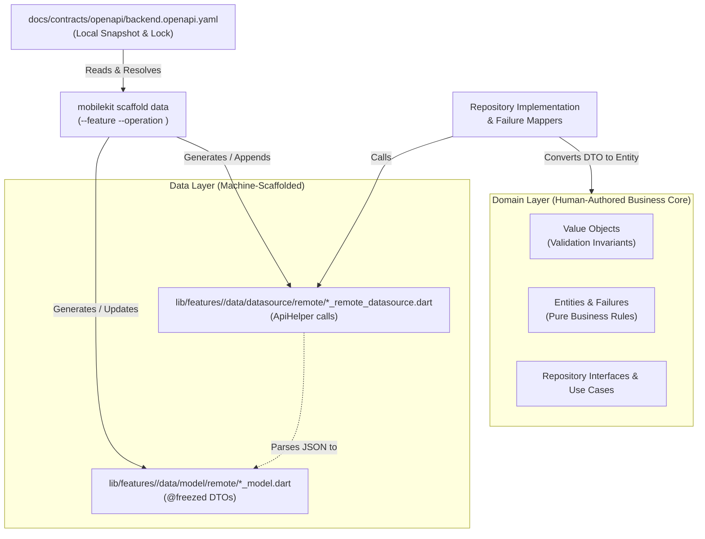

# Engineering Proposal: OpenAPI-Driven Data Layer Scaffolding

**Status:** Draft / Proposed  
**Author:** Pair Programming Agent  
**Date:** 2026-09-24  
**Scope:** `packages/mobile_core_kit_cli` and `lib/features/<feature>/data/`  
**Related Documents:**
- [`docs/contracts/openapi/backend.openapi.yaml`](file:///home/fikrilal/devs/core/mobile-core-kit/docs/contracts/openapi/backend.openapi.yaml) (API Contract Snapshot)
- [`docs/engineering/data_domain_guide.md`](file:///home/fikrilal/devs/core/mobile-core-kit/docs/engineering/data_domain_guide.md) (Data & Domain Architecture)
- [`docs/engineering/model_entity_guide.md`](file:///home/fikrilal/devs/core/mobile-core-kit/docs/engineering/model_entity_guide.md) (DTO vs Entity Conventions)
- [`docs/engineering/project_architecture.md`](file:///home/fikrilal/devs/core/mobile-core-kit/docs/engineering/project_architecture.md) (Layer Boundaries)

---

## 1. Executive Summary

This proposal defines an enhancement to `mobilekit scaffold` that automates data-layer boilerplate using the repository's pinned OpenAPI 3.0 specification ([`docs/contracts/openapi/backend.openapi.yaml`](file:///home/fikrilal/devs/core/mobile-core-kit/docs/contracts/openapi/backend.openapi.yaml)).

By targeting a specific `operationId` or path, the CLI will generate:
1. **Remote Request DTOs** (`@freezed` + `@JsonSerializable`)
2. **Remote Response DTOs** (`@freezed` + `@JsonSerializable`)
3. **Remote DataSource method signatures** (`ApiHelper` calls with endpoints and parsers)

To preserve Clean Architecture invariants, generation is **strictly confined to the Data layer**. Domain entities, value objects, and error mappers will **not** be generated from OpenAPI schemas.

---

## 2. Context & Problem Statement

Currently, adding a new feature or endpoint requires writing substantial boilerplate in the data layer:
- Writing Freezed models with `@JsonSerializable` for requests and responses.
- Writing JSON serialization boilerplate (`part '*.freezed.dart'`, `part '*.g.dart'`).
- Manually mapping field types, nullability, and snake_case vs camelCase naming.
- Wiring `ApiHelper` methods in remote data sources with correct paths, HTTP verbs, and parsers.

Because [`docs/contracts/openapi/backend.openapi.yaml`](file:///home/fikrilal/devs/core/mobile-core-kit/docs/contracts/openapi/backend.openapi.yaml) is already tracked, pinned, and verified in CI, manual authoring of DTOs introduces unnecessary human error (e.g., misspelled field names, incorrect nullability) and repetitive mechanical effort.

---

## 3. Goals and Non-Goals

### Goals
1. **Accelerate Data Layer Authoring**: Scaffold verified Freezed DTOs and DataSource methods directly from the repository's local OpenAPI contract.
2. **Eliminate Schema Drift**: Ensure generated request/response field names, types, and nullability match backend specifications verbatim.
3. **Strict Layer Boundary Isolation**: Enforce that OpenAPI schemas only inform network transport DTOs (`data/model/remote/`), never leaking into the domain layer.
4. **Deterministic & Offline**: Execute entirely against the pinned local repository contract without external network calls.
5. **Incremental & Safe**: Allow generating data operations into existing features without overwriting uncommitted code without explicit flags.

### Non-Goals
1. **No Domain Layer Generation**: The CLI will not generate Domain Entities, Value Objects (`EmailAddress`, `Password`), Use Cases, or Domain Repositories from OpenAPI schemas.
2. **No Error Mapper Auto-generation**: Backend error payloads do not define feature-level domain failures (`InvalidCredentialsFailure`); error mappers remain developer-authored.
3. **No Heavy Monolithic Client**: We will not generate a monolithic global API SDK or replace `ApiHelper`. The generated code integrates into standard feature-scoped slices.
4. **No Arbitrary Full-Spec OpenAPI 3.1 Compiler**: Complex polymorphism (`oneOf`, `anyOf`), discriminator hierarchies, and recursive schemas are out of initial scope.

---

## 4. Architectural Boundaries and Invariants



### Invariants:
1. **Clean Architecture Boundary**: DTOs live in `data/model/remote/` and are never imported by `domain/`.
2. **Local Contract Authority**: The CLI only reads the local locked spec (`docs/contracts/openapi/backend.openapi.yaml`). It never reaches out to a remote backend URL during code generation.
3. **Repository Conventions**:
   - Models use `@freezed` with `const factory ... = _...;` and `factory ...fromJson(...)`.
   - Classes use `PascalCase` with `Model` suffix.
   - Field names are `camelCase`.
   - Files are `snake_case.dart` matching `*_request_model.dart` and `*_response_model.dart`.
   - Datasources accept and utilize `ApiHelper`.

---

## 5. Proposed Design & CLI Interface

### 5.1 CLI Command

Extend `mobilekit scaffold` with a `data` subcommand:

```bash
# Generate models and datasource stub for a specific operation
dart run mobile_core_kit_cli:mobilekit scaffold data \
  --feature merchant_onboarding \
  --operation merchant.onboard

# Dry run to inspect generated code without writing files
dart run mobile_core_kit_cli:mobilekit scaffold data \
  --feature merchant_onboarding \
  --operation merchant.onboard \
  --dry-run

# Skip automatic build_runner codegen (useful for batching)
dart run mobile_core_kit_cli:mobilekit scaffold data \
  --feature merchant_onboarding \
  --operation merchant.onboard \
  --no-codegen

# Interactive list of available operations for a tag/keyword
dart run mobile_core_kit_cli:mobilekit scaffold data --list --filter merchant
```

### 5.2 Schema Resolution

The workflow will:
1. Parse [`docs/contracts/openapi/backend.openapi.yaml`](file:///home/fikrilal/devs/core/mobile-core-kit/docs/contracts/openapi/backend.openapi.yaml).
2. Locate the operation matching `--operation <id>` (or path + HTTP method).
3. Extract:
   - **HTTP Method & Path**: e.g., `POST /v1/merchants/onboard`
   - **Request Body Schema**: Resolves direct schema or `#/components/schemas/<Name>`.
   - **Success Response Schema**: Resolves `200` or `201` response content (`application/json`).
   - **Tags / Operation Name**: Used for naming files and methods.

### 5.3 Type Mapping Matrix

| OpenAPI Schema Type | Dart Type | Freezed / Serialization Handling |
| :--- | :--- | :--- |
| `string` | `String` | Direct |
| `string (format: date-time)` | `DateTime` | Deserialized by `json_serializable` |
| `string (enum)` | `String` (or generated Dart enum) | String with doc comments or separate enum |
| `integer` | `int` | Direct |
| `number` | `double` | Direct |
| `boolean` | `bool` | Direct |
| `array` (items: primitive) | `List<T>` | Direct |
| `array` (items: `$ref`) | `List<SubModel>` | Triggers generation of `SubModel` |
| `object` (`$ref`) | `SubModel` | Triggers generation of `SubModel` |
| Field not in `required` | `T?` | Nullable property, default `null` |

### 5.4 Generated Code Structure

#### A. Request Model (`lib/features/<f>/data/model/remote/<operation>_request_model.dart`)
```dart
import 'package:freezed_annotation/freezed_annotation.dart';

part '<operation>_request_model.freezed.dart';
part '<operation>_request_model.g.dart';

// ignore_for_file: invalid_annotation_target

@freezed
abstract class <Operation>RequestModel with _$<Operation>RequestModel {
  @JsonSerializable(includeIfNull: false)
  const factory <Operation>RequestModel({
    required String businessName,
    required String taxId,
    String? contactPhone,
  }) = _<Operation>RequestModel;

  const <Operation>RequestModel._();

  factory <Operation>RequestModel.fromJson(Map<String, dynamic> json) =>
      _$<Operation>RequestModelFromJson(json);
}
```

#### B. Response Model (`lib/features/<f>/data/model/remote/<operation>_response_model.dart`)
Follows identical Freezed structure with properties matching 200/201 response schema.

#### C. Core Endpoint Constants (`lib/core/infra/network/endpoints/<feature>_endpoint.dart`)
If the endpoint file exists, append the constant (if not already present). If it does not exist, create it:
```dart
/// Endpoint constants for the <feature> feature (core API host).
///
/// Paths exclude the `/v1` prefix because the core host base URL already
/// carries it (see `BuildConfigValues._devHosts` / `_stagingHosts`).
class <Feature>Endpoint {
  <Feature>Endpoint._();

  static const String <operationConstant> = '<strippedPath>';
}
```

#### D. DataSource Integration (`lib/features/<f>/data/datasource/remote/<feature>_remote_datasource.dart`)
If the datasource does not exist, scaffold a new class. If it exists, append the new method:
```dart
  Future<ApiResponse<<Operation>ResponseModel>> <operationMethodName>(
    <Operation>RequestModel requestModel,
  ) async {
    Log.info('Executing <operationMethodName>', name: _tag);

    final response = await _apiHelper.post<<Operation>ResponseModel>(
      <Feature>Endpoint.<operationConstant>,
      data: requestModel.toJson(),
      requiresAuth: true,
      throwOnError: false,
      parser: <Operation>ResponseModel.fromJson,
    );
    return response;
  }
```

### 5.5 Targeted Code Generation (`build_runner`)

To make newly scaffolded models immediately compilable without paying the cost of a full project build (15–30s), the workflow automatically triggers targeted codegen via `build_runner`'s `--build-filter`:

```bash
dart run build_runner build \
  --delete-conflicting-outputs \
  --build-filter="lib/features/<feature>/data/model/remote/**"
```

- **Targeted & Fast:** Only builds the AST for the newly generated model files and their parts (`*.freezed.dart`, `*.g.dart`), finishing in ~1–2 seconds.
- **Opt-out (`--no-codegen`):** When generating models for multiple endpoints in sequence, `--no-codegen` suppresses this step so the developer can run a single targeted build at the end.

---

## 6. Risks, Limitations & Mitigations

| Risk / Limitation | Impact | Mitigation |
| :--- | :--- | :--- |
| **Complex Schema Polymorphism** (`oneOf`, `anyOf`, `allOf`) | Freezed cannot cleanly model arbitrary schema unions without complex discriminator annotations. | Downgrade unsupported polymorphic fields to `Map<String, dynamic>` or `Object` with a clear `// TODO: Resolve union schema` lint warning. |
| **Accidental Overwrite of Customizations** | User adds helper methods (e.g., `fromEntity`) to existing DTOs, and re-running scaffold blows them away. | Default to fail-if-exists; require `--force` to overwrite existing model files. For datasources, append methods instead of rewriting the file. |
| **Codegen Pending State & Slow Builds** | Freezed models require running `build_runner` before the project compiles, but a full build is slow. | CLI automatically invokes targeted `build_runner build --build-filter="lib/features/<f>/data/model/remote/**"` (1–2s). `--no-codegen` is available to skip. |
| **API Contract Desync** | Local OpenAPI spec is out of sync with backend. | Guarded by existing `mobilekit contract openapi verify` check. CLI validates contract presence before generating. |

---

## 7. Acceptance Criteria

1. **CLI Flag Support**: `mobilekit scaffold data` correctly parses `--feature`, `--operation`, `--dry-run`, `--force`, and `--no-codegen`.
2. **Model Correctness**:
   - Generated models compile under `build_runner`.
   - Types, field names, and nullability match the OpenAPI schema.
   - Discrete string enums generate type-safe Dart `enum`s with `@JsonValue`.
   - Generated code passes `flutter_lints` and `dart run mobile_core_kit_cli:mobilekit lint`.
3. **Endpoint & Datasource Correctness**:
   - Scaffolds/appends endpoint constant in `lib/core/infra/network/endpoints/<feature>_endpoint.dart` with `/v1` prefix stripped.
   - Generates correct HTTP method (`get`, `post`, `put`, `delete`, `patch`), endpoint constant reference, request payload, and response parser.
4. **Targeted Codegen Execution**:
   - By default (unless `--no-codegen` or `--dry-run` is passed), executes `dart run build_runner build --build-filter=...` targeting only the affected feature DTO folder.
5. **Boundary Honesty**:
   - No domain files (`lib/features/<feature>/domain/**`) are modified or created by this command.
6. **CLI Test Coverage**:
   - Automated unit test in `packages/mobile_core_kit_cli/test/` asserting mock OpenAPI schema resolution to Freezed Dart source output.

---

## 8. Settled Decisions

1. **Enum Generation**: Discrete string enums in OpenAPI will generate type-safe Dart `enum`s with `@JsonValue` mappings in `lib/features/<feature>/data/model/remote/` or alongside the DTO.
2. **Endpoint Constants**: Scaffolding will manage feature endpoint classes in `lib/core/infra/network/endpoints/<feature>_endpoint.dart`, stripping the `/v1` prefix according to existing repo conventions (`MerchantOnboardingEndpoint`, `AuthEndpoint`).
