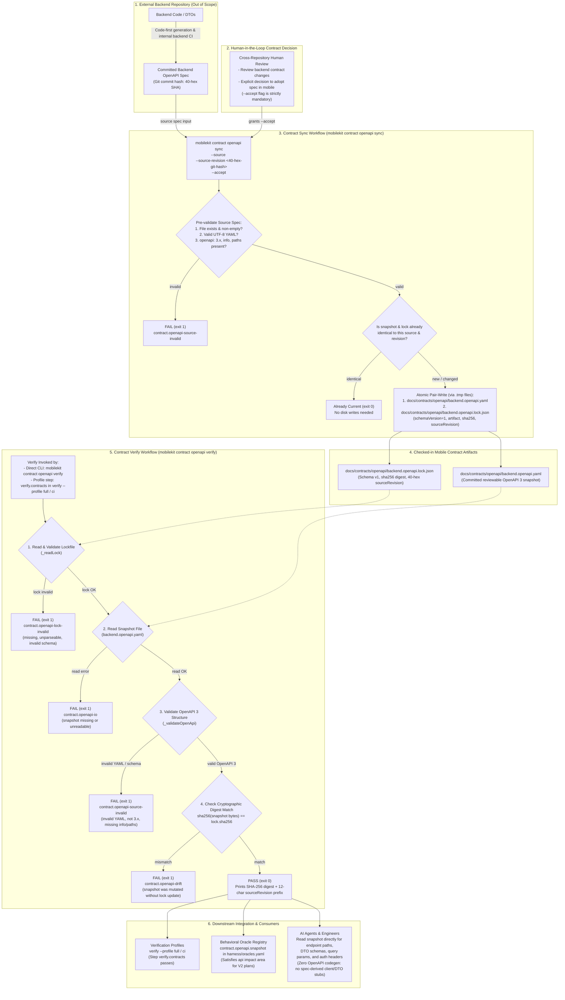
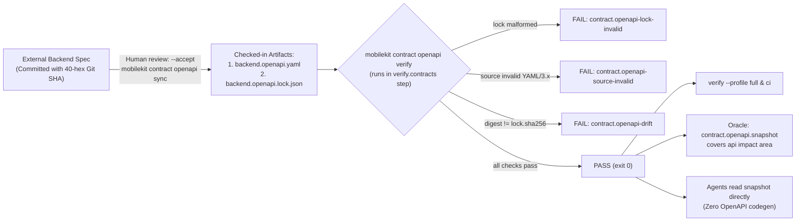

# OpenAPI Contract Verifier Harness — System Flowchart

Source of truth:
- `packages/mobile_core_kit_cli/lib/src/contracts/openapi_contract_workflow.dart`
- `packages/mobile_core_kit_cli/lib/src/verification/verification_profile.dart` (Step `verify.contracts`)
- `docs/contracts/openapi/README.md`
- `docs/engineering/behavioral_oracles.md`
- `harness/oracles.yaml`

---

## 1. Full Architecture & Execution Flow

---

## 2. Compact / Overview Flowchart

---

## 3. Failure Taxonomy & Invariants

| Failure Code | Trigger Condition | Remediation |
| :--- | :--- | :--- |
| `contract.openapi-lock-invalid` | `backend.openapi.lock.json` is missing, unparseable JSON, `schemaVersion != 1`, missing `artifact` target, `sha256` not 64-hex string, or `sourceRevision` not 40-hex string. | Re-sync from the accepted backend commit using `mobilekit contract openapi sync`. |
| `contract.openapi-source-invalid` | `backend.openapi.yaml` is not valid UTF-8 YAML, `openapi` version doesn't start with `'3.'`, or is missing top-level `info` or `paths` mappings. | Fix the YAML structure or obtain a valid OpenAPI 3 spec from backend. |
| `contract.openapi-drift` | SHA-256 hash of `backend.openapi.yaml` does not match the `sha256` recorded in `backend.openapi.lock.json`. | Snapshot was modified without human-reviewed sync. Re-sync with `--accept` or revert unauthorized modifications. |
| `contract.openapi-io` | File system read error when attempting to read the snapshot or lockfile. | Check directory permissions or restore missing files. |

### Key Architectural Invariants

1. **Mobile Repository Ownership**: The mobile repo owns its reviewable snapshot (`docs/contracts/openapi/backend.openapi.yaml`) and lockfile (`backend.openapi.lock.json`). It does not depend on an active backend server or local absolute paths.
2. **No Developer Path Leakage**: The lockfile records only the relative artifact path, SHA-256 digest, and 40-hex Git commit hash from the backend repo. Developer checkout paths are never committed.
3. **Atomic Operations**: All writes in `sync` use temporary files (`.tmp`) and atomic renames to prevent partial or corrupted file states on failure or cancellation.
4. **Direct Consumption (Zero OpenAPI Codegen)**: No client SDK or DTO generator is run against the OpenAPI specification. AI coding agents and engineers read the snapshot directly as the contract source of truth. (Internal Freezed / JSON serialization via `build_runner` remains standard for app models, but is decoupled from any OpenAPI generator tooling).
