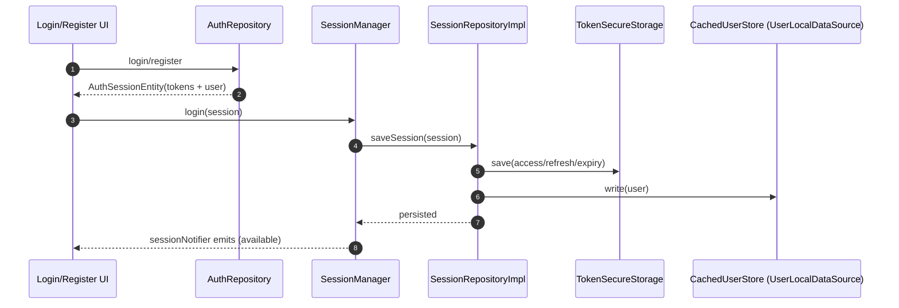
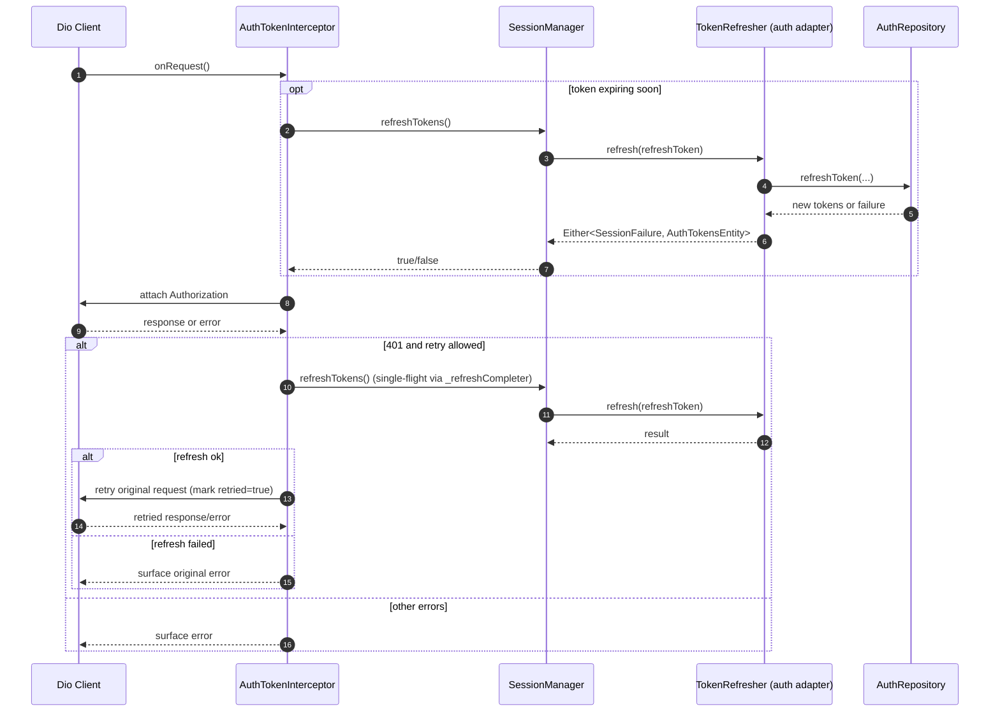
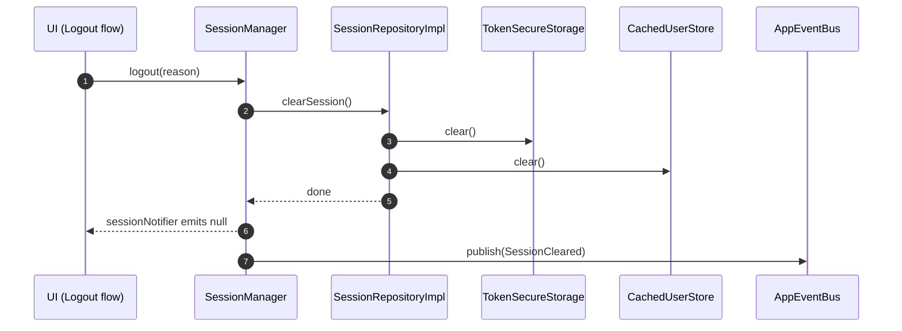

# End-to-End Flows (With Diagrams)

This document describes the **runtime flows** of session + current user in detail.

If you want “where does this class live?” first, read: `docs/core/session/system_tree.md`.

---

## 1) Boot sequence (DI + startup gate)

At a high level:

1) `registerLocator()` sets up lightweight synchronous dependencies.
2) `runApp()` renders first frame.
3) `bootstrapLocator()` runs async initialization and calls `AppStartupController.initialize()`.
4) UI is blocked by `AppStartupGate` until `AppStartupController` becomes ready.

Key files:

- DI composition: `lib/core/di/service_locator.dart`
- Startup orchestrator: `lib/core/services/app_startup/app_startup_controller.dart`
- Startup gate UI: `lib/core/widgets/loading/app_startup_gate.dart`

---

## 2) Cold start: restore tokens → restore cached user → hydrate via `GET /me` (when needed)

### Narrative

Cold start must be:

- fast (don’t block first frame)
- safe (never show wrong cached user after account switch)
- deterministic (race guards)

The flow is:

1) Restore tokens from secure storage (timeout-protected by `AppStartupController`)
2) Emit session (often “auth pending”: tokens exist but `user == null`)
3) Start cached-user restore (best-effort; non-blocking)
4) After startup is ready and onboarding is complete:
   - if still auth pending, attempt a short wait for cached-user restore
   - then hydrate user via `GET /me`

### Sequence diagram

```mermaid
sequenceDiagram
  autonumber
  participant App as App Bootstrap
  participant DI as ServiceLocator
  participant Startup as AppStartupController
  participant Session as SessionManager
  participant Repo as SessionRepositoryImpl
  participant Secure as TokenSecureStorage
  participant Cache as CachedUserStore (UserLocalDataSource)
  participant Me as CurrentUserFetcher (GetMeUseCase adapter)

  App->>DI: registerLocator()
  App->>DI: bootstrapLocator()
  DI->>Startup: initialize()

  Startup->>Session: init() (timeout-protected)
  Session->>Repo: loadSession()
  Repo->>Secure: read()
  Secure-->>Repo: access/refresh/expiresIn(/expiresAt)
  Repo-->>Session: AuthSessionEntity(tokens, user=null)
  Session-->>Startup: sessionNotifier emits (authPending)

  Note over Session: Non-blocking cached user restore
  Session->>Repo: loadCachedUser()
  Repo->>Cache: read()
  Cache-->>Repo: UserEntity? (cached me)
  Repo-->>Session: cached user (optional)
  Session-->>Startup: sessionNotifier emits (maybe available)

  Startup->>Startup: If onboarding complete AND still authPending
  Startup->>Me: fetch() (GET /me)
  Me-->>Startup: Either<SessionFailure, UserEntity>
  alt success
    Startup->>Session: setUser(user)
    Session->>Repo: saveSession(tokens + user)
    Repo->>Secure: save(access/refresh/expiry)
    Repo->>Cache: write(user)
  else unauthenticated
    Startup->>Session: logout(reason: hydrate_unauthenticated)
    Session->>Repo: clearSession()
    Repo->>Secure: clear()
    Repo->>Cache: clear()
  else transient failure
    Note over Startup: Do not logout; wait for later online/cooldown retry
  end
```

### Race guards (why they matter)

Common bug in apps:

- `GET /me` returns for an old session after the user logged out or switched accounts, and the app applies it anyway.

Guards used in this template:

- cached-user restore: guard by access token snapshot
  - `SessionManager.restoreCachedUserIfNeeded()` captures `accessTokenAtStart`
  - it only applies cached user if the access token still matches
- hydration: guard by refresh token snapshot
  - `AppStartupController._hydrateUser()` captures `refreshTokenAtStart`
  - it ignores results if refresh token changed

Why refresh token for hydration?

- Access token can rotate due to token refresh; refresh token is a more stable session identifier.

---

## 3) Login / Register: create session and persist immediately

High-level:

1) Auth feature calls backend (login/register)
2) Receives `AuthSessionEntity(tokens + user)`
3) Calls `SessionManager.login(session)`
4) Session is persisted:
   - tokens → secure storage
   - user → cached user store (sqflite)



Notes:

- `SessionManager.login` computes `expiresAt` if the token payload did not contain it.

---

## 4) Request-time auth: attach token, refresh, retry (Dio interceptor)

This flow is the “always-on” part of the system:

- For most product screens, the developer just uses `ApiHelper`/datasources.
- `AuthTokenInterceptor` ensures Authorization + refresh/retry policy.

### Preflight refresh

Before sending a request:

- if `SessionManager.isAccessTokenExpiringSoon`:
  - `AuthTokenInterceptor` attempts `_refreshOnce()` (best-effort)
- then it attaches `Authorization` header

### 401 refresh + retry

On a 401 response:

- `AuthTokenInterceptor` decides whether it can retry:
  - reads are retryable
  - writes require `Idempotency-Key`
- it performs `_refreshOnce()` (single-flight)
- if refresh succeeds, it retries the request once



### Retry safety (writes)

The retry policy is intentionally conservative:

- GET/HEAD: retryable
- POST/PUT/PATCH/DELETE: retryable only if an `Idempotency-Key` header exists

Reason:

- without idempotency, retrying writes can create duplicate charges/orders/side-effects.

The backend contract is documented in:

- `docs/contracts/auth/auth_refresh_and_retry_contract.md`

---

## 5) Logout: always clear tokens + cached user and publish events

Logout must always:

- clear secure tokens
- clear cached user
- emit `sessionNotifier = null`
- publish `SessionCleared`

This is done by `SessionManager.logout()` via `SessionRepository.clearSession()`.



---

## 6) UI consumption: `UserContextService` as the stable API

UI should bind to `UserContextService` instead of session or tokens directly:

- `UserContextService` listens to session changes and provides computed properties.
- it can trigger an explicit refresh (`refreshUser`) when needed.

```mermaid
flowchart LR
  Session["SessionManager\n(sessionNotifier)"] -->|observe| UCtx["UserContextService\n(stateListenable + helpers)"]
  UCtx --> UI["UI (Profile header, settings, etc.)"]

  UCtx -->|refreshUser()| Fetch["CurrentUserFetcher\n(user feature adapter)"]
  Fetch -->|GET /me| API["Backend"]
  Fetch --> UCtx
  UCtx -->|setUser(user)| Session
```

Key invariants:

- `UserContextService` never owns lifecycle (no implicit login).
- It resets derived state when it observes `SessionCleared/SessionExpired`.
- It guards against applying refresh results across session switches.

---

## Guest mode semantics (template default)

This template supports **guest mode** (signed-out users can still use guest-eligible surfaces).

Representation:

- Guest mode is simply `SessionManager.session == null`.
- There are no “guest tokens”; access to protected APIs will fail (and should be guarded in routing/UI).

Important invariant:

- Cached “me” is **cleared** on logout/session clear. Guest mode must never show a previous account’s identity.
