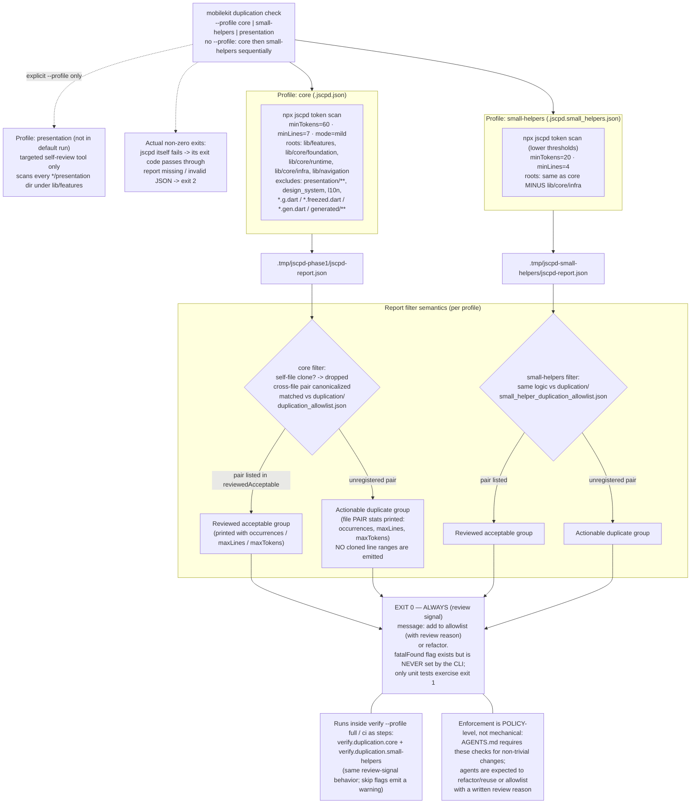
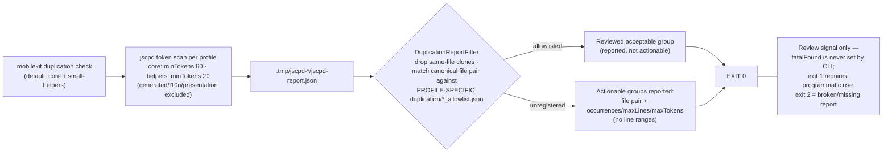

# Duplication Sensor Harness — Corrected Flowchart

Source of truth:
- `packages/mobile_core_kit_cli/lib/src/duplication/duplication_runner.dart`
- `packages/mobile_core_kit_cli/lib/src/duplication/duplication_report_filter.dart`
- `.jscpd.json`, `.jscpd.small_helpers.json`, `.jscpd.presentation.json`
- `duplication/*_allowlist.json`
- `docs/engineering/mobilekit_cli_reference.md` (`duplication check`)
- Test evidence: `test/duplication_report_filter_test.dart`

## Full version

## Compact version

## Corrections vs. the original flowchart

1. **"FAIL (exit 1) on new/wild duplication" removed** — factually wrong as wired. `DuplicationReportFilter.run()` returns `fatalFound ? 1 : 0`, and no CLI path sets `fatalFound`. Actionable duplication exits **0** with a remediation hint ("add to allowlist with a review reason or refactor"). The test suite names this explicitly: *"lists actionable groups but returns 0 by default (review signal)"*. Real failures: jscpd's own exit code, or exit 2 for missing/invalid reports.
2. **Single shared allowlist node split into per-profile files**: core → `duplication/duplication_allowlist.json`, small-helpers → `duplication/small_helper_duplication_allowlist.json`, presentation → `duplication/presentation_duplication_allowlist.json`.
3. **"Emits Cloned Line Ranges" corrected** — output prints grouped file-pair statistics (`occurrences`, `maxLines`, `maxTokens`) only; line data stays inside the raw jscpd JSON report.
4. **Profile descriptions made literal** — actual scan roots, thresholds (`60/20` tokens), and ignore lists replace impressionistic labels ("mappers/models", "date/currency/string utils").
5. **Added omitted pieces**: third `presentation` profile (explicit-opt-in only), same-file clone filtering, order-insensitive canonical pair matching, wiring into `verify --profile full/ci`, and the policy-level (AGENTS.md) nature of the actual enforcement.
