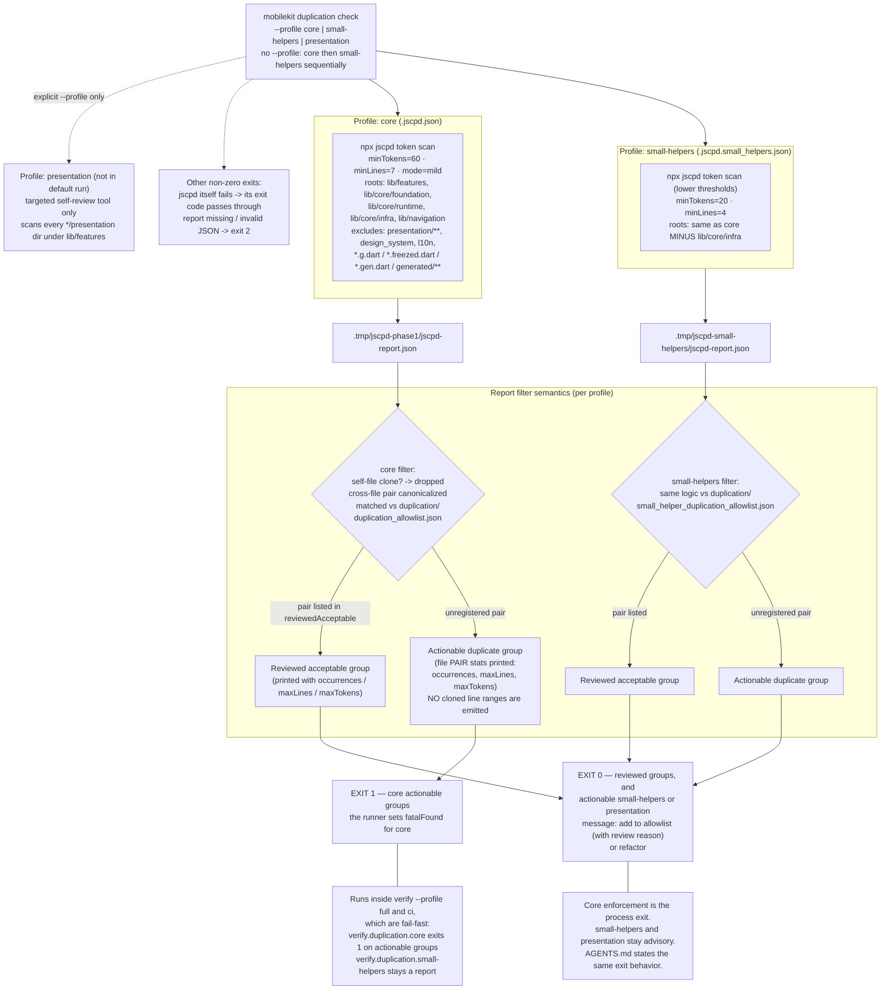
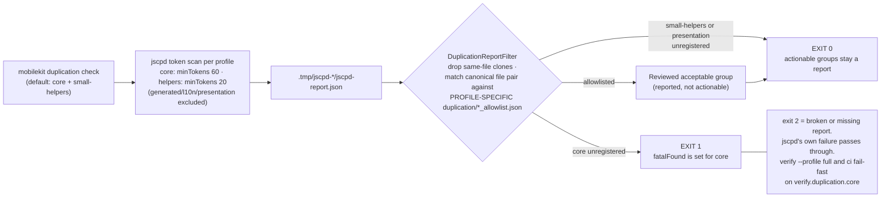

# Duplication Sensor Harness — Corrected Flowchart

Source of truth:
- `packages/mobile_core_kit_cli/lib/src/duplication/duplication_runner.dart`
- `packages/mobile_core_kit_cli/lib/src/duplication/duplication_report_filter.dart`
- `.jscpd.json`, `.jscpd.small_helpers.json`, `.jscpd.presentation.json`
- `duplication/*_allowlist.json`
- `docs/engineering/harness/mobilekit_cli_reference.md` (`duplication check`)
- Test evidence: `test/duplication_report_filter_test.dart`

## Full version

## Compact version

## Corrections vs. the original flowchart

1. **`core` exits 1 on actionable groups.** The runner sets `fatalFound` for `core`. `small-helpers` and `presentation` still report actionable groups and exit 0. A missing or invalid report exits 2. jscpd's own failure passes through.
2. **Single shared allowlist node split into per-profile files**: core → `duplication/duplication_allowlist.json`, small-helpers → `duplication/small_helper_duplication_allowlist.json`, presentation → `duplication/presentation_duplication_allowlist.json`.
3. **"Emits Cloned Line Ranges" corrected** — output prints grouped file-pair statistics (`occurrences`, `maxLines`, `maxTokens`) only; line data stays inside the raw jscpd JSON report.
4. **Profile descriptions made literal** — actual scan roots, thresholds (`60/20` tokens), and ignore lists replace impressionistic labels ("mappers/models", "date/currency/string utils").
5. **Added omitted pieces**: third `presentation` profile (explicit-opt-in only), same-file clone filtering, order-insensitive canonical pair matching, and wiring into `verify --profile full` and `ci`. Core enforcement is the process exit inside those fail-fast profiles. `small-helpers` and `presentation` stay advisory.
