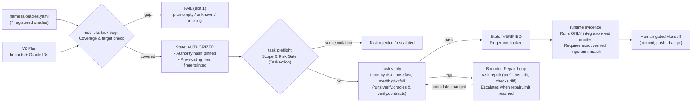

# Behavioral Oracle Harness — System Flowchart

Source of truth:
- `packages/mobile_core_kit_cli/lib/src/oracle/oracle_registry.dart`
- `packages/mobile_core_kit_cli/lib/src/oracle/oracle_workflow.dart`
- `packages/mobile_core_kit_cli/lib/src/task/task_service.dart` (`begin`, `preflight`)
- `packages/mobile_core_kit_cli/lib/src/task/task_controller.dart` (lane runner & repair loop)
- `packages/mobile_core_kit_cli/lib/src/task/task_failure.dart` (`verificationFailureTaxonomy`)
- `packages/mobile_core_kit_cli/lib/src/task/task_plan.dart` (`TaskAction`, `TaskBoundaries`)
- `packages/mobile_core_kit_cli/lib/src/runtime/runtime_evidence_binding.dart`
- `packages/mobile_core_kit_cli/lib/src/verification/verification_profile.dart`
- `docs/engineering/behavioral_oracles.md`
- `harness/oracles.yaml`

---

## 1. Full Architecture & Execution Flow

```mermaid
flowchart TB
    subgraph Registry["1. Checked-in Oracle Registry (harness/oracles.yaml)"]
        direction TB
        O1["auth.integration<br/>kind: integration-test · covers: [auth]"]
        O2["startup.integration<br/>kind: integration-test · covers: [navigation]"]
        O3["contract.openapi.snapshot<br/>kind: contract · covers: [api]"]
        O4["harness.full<br/>kind: verification-profile · covers: [harness, database]"]
        O5["runtime.mobile-evidence<br/>kind: procedure · covers: [platform]"]
        O6["ui.human-review<br/>kind: manual-review · covers: [ui]"]
        O7["external.human-review<br/>kind: manual-review · covers: [external-systems]"]
    end

    subgraph PlanSection["2. Execution Plan & Task Initialization"]
        direction TB
        Plan["V2 Execution Plan (docs/exec-plans/active/*.md)<br/>- Declared Impacts: auth, navigation, api, etc.<br/>- Declared Oracle IDs: e.g. [auth.integration, startup.integration]<br/>(Low-risk plans may omit Oracle IDs)"]
        
        BeginCmd["mobilekit task begin --plan <plan-path>"]
        
        CoverageGate{"Oracle Coverage Gate<br/>_validateOracles(plan)"}
        BeginRej["FAIL (exit 1)<br/>oracle.plan-empty<br/>oracle.plan-unknown<br/>oracle.plan-coverage-missing<br/>oracle.target-missing"]
        
        StateAuth["Task State: AUTHORIZED<br/>- Pins authorityHash (includes Oracle IDs)<br/>- Captures Git baseRevision<br/>- Fingerprints pre-existing dirty files"]
        
        Plan --> BeginCmd
        Registry --> CoverageGate
        BeginCmd --> CoverageGate
        CoverageGate -->|"gap / missing target"| BeginRej
        CoverageGate -->|"all impacts covered"| StateAuth
    end

    subgraph PreflightSection["3. Scope & Authority Preflight Gate"]
        direction TB
        PreflightAction["Controlled Task Action Request<br/>(TaskAction: edit / verify / commit / push / draft-pr)"]
        
        PreflightChecks{"mobilekit task preflight<br/>1. Authority unchanged?<br/>2. Oracle coverage valid?<br/>3. Action permitted in plan?<br/>4. Changes inside allowedPaths?<br/>5. Effective risk <= max risk?"}
        
        PreflightFail["FAIL task.scope-violation /<br/>task.authority-changed /<br/>task.risk-above-authority /<br/>task.action-not-authorized"]
        
        PreflightPass["Preflight OK<br/>Generates SHA-256 taskFingerprint<br/>(authorityHash + baseRevision + effectiveRisk + taskPaths)"]
        
        StateAuth --> PreflightAction
        PreflightAction --> PreflightChecks
        PreflightChecks -->|"violation"| PreflightFail
        PreflightChecks -->|"pass"| PreflightPass
    end

    subgraph VerifySection["4. Controlled Verification & Repair Loop"]
        direction TB
        VerifyCmd["mobilekit task verify --task <id> --env dev<br/>State: VERIFYING"]
        
        LaneSelect{"Select Profile Lane<br/>by effectiveRisk"}
        LaneFast["Profile: FAST<br/>(lint, format, schemas, CLI tests,<br/>focused application tests)"]
        LaneFull["Profile: FULL<br/>(codegen freshness, verify.oracles,<br/>verify.contracts, duplication checks,<br/>all application tests)"]
        
        RunLane["Execute Profile Steps (fail-fast)"]
        
        Decision{"All Steps Passed?<br/>(exitCode == 0)"}
        
        StateVerified["State: VERIFIED<br/>- Records lastTaskFingerprint<br/>- Ready for review / runtime"]
        
        FailBoundary["Identify Failure Taxonomy<br/>(analysis.repository, format.dart, codegen.drift,<br/>duplication.core, test.application, etc.)"]
        
        BudgetCheck{"Repair Budget Left?<br/>(repairCount < repairLimit & not timed out)"}
        
        StateEscalated["State: ESCALATED<br/>- AI halted immediately<br/>- Human intervention required"]
        StateFailed["State: FAILED<br/>(records sanitized failure diagnostic)"]
        
        AgentEdit["Agent fixes code in allowedPaths<br/>using normal tools"]
        
        RepairCmd["mobilekit task repair --task <id><br/>(internally preflights action: edit)"]
        
        FingerprintCheck{"Candidate Fingerprint<br/>Changed from Failure?"}
        
        WasteBudget["repair-made-no-change<br/>repairCount + 1 · stays FAILED"]
        ResetAuth["repair-changed-candidate<br/>repairCount + 1 · State -> AUTHORIZED"]
        
        PreflightPass --> VerifyCmd
        VerifyCmd --> LaneSelect
        LaneSelect -->|"low risk"| LaneFast --> RunLane
        LaneSelect -->|"medium / high risk"| LaneFull --> RunLane
        
        RunLane --> Decision
        Decision -->|"YES"| StateVerified
        Decision -->|"NO"| FailBoundary --> BudgetCheck
        
        BudgetCheck -->|"NO / exhausted / timeout"| StateEscalated
        BudgetCheck -->|"YES / retries remain"| StateFailed --> AgentEdit --> RepairCmd --> FingerprintCheck
        
        FingerprintCheck -->|"No Change"| WasteBudget --> BudgetCheck
        FingerprintCheck -->|"Changed"| ResetAuth --> VerifyCmd
    end

    subgraph RuntimeSection["5. Mobile Runtime Evidence Gate"]
        direction TB
        RuntimeCmd["mobilekit runtime evidence --task <id> --device <device-id>"]
        
        RuntimePreconditions{"Preconditions Check:<br/>1. State == VERIFIED?<br/>2. Exact taskFingerprint match?<br/>3. Contains kind: integration-test oracle?"}
        
        RuntimeRej["FAIL<br/>runtime.task-not-verified /<br/>runtime.oracle-missing"]
        
        RunIntegration["Execute Single-Flight Integration Tests<br/>on real device/emulator for selected targets<br/>(e.g. auth_happy_path_test.dart)"]
        
        EvidenceArtifacts["Generate Durable Evidence<br/>- _artifacts/mobile/<timestamp>/evidence.json<br/>- summary.md (sanitized, PII/token-free)"]
        
        StateVerified --> RuntimeCmd
        RuntimeCmd --> RuntimePreconditions
        RuntimePreconditions -->|"fail"| RuntimeRej
        RuntimePreconditions -->|"pass"| RunIntegration --> EvidenceArtifacts
    end
```

---

## 2. Compact / Overview Flowchart

---

## 3. Core System Mechanics & Failure Codes

| Stage | Command / Trigger | Failure Codes & Guardrails | Behavioral Mechanism |
| :--- | :--- | :--- | :--- |
| **Registry Gate** | `mobilekit task begin` / `mobilekit oracle verify` | `oracle.registry-missing` `oracle.registry-invalid` `oracle.target-missing` `oracle.plan-empty` `oracle.plan-unknown` `oracle.plan-coverage-missing` | Fails closed. Medium and high-risk plans must select registered oracles covering 100% of declared `yes` impacts. Target files must physically exist in the repository. |
| **Authority Pinning** | `mobilekit task begin` | `task.authority-changed` `task.plan-outside-scope` | Authority hash binds the plan metadata, allowed paths, allowed actions (`TaskAction: edit, verify, commit, push, draft-pr`), risk ceiling, and selected Oracle IDs. Any post-begin modification requires reauthorization. |
| **Scope & Risk Preflight** | `mobilekit task preflight` | `task.scope-violation` `task.risk-above-authority` `task.action-not-authorized` | Task-owned file changes are strictly restricted to `allowedPaths`. `RiskClassifier` dynamically calculates effective risk from touched files (automation can raise risk, never lower it). |
| **Verification Lanes** | `mobilekit task verify` | `verification.unknown` `analysis.repository` `format.dart` `codegen.drift` `duplication.core` `test.application` | Low risk runs `fast` lane (~1 min); medium/high risk runs `full` lane. Profile steps include `verify.oracles` (checks all repo V2 plans) and `verify.contracts` (checks OpenAPI snapshot digest). |
| **Bounded Repair** | `mobilekit task repair` | `task.repair-not-available` `task.repair-budget-exhausted` `task.timeout` | If verification fails, agent repairs code in `allowedPaths`. `task repair` internally preflights `action: TaskAction.edit` and checks whether `taskFingerprint` actually changed. If identical, budget decrements without retry. If budget exhausted, transitions to `ESCALATED` halting AI execution. |
| **Runtime Evidence** | `mobilekit runtime evidence` | `runtime.task-not-verified` `runtime.oracle-missing` | Can execute only when lifecycle is `VERIFIED` with exact fingerprint match. Automatically filters task's `oracleIds` to `kind: integration-test` targets. Single-flight device execution producing sanitized `evidence.json`. |
