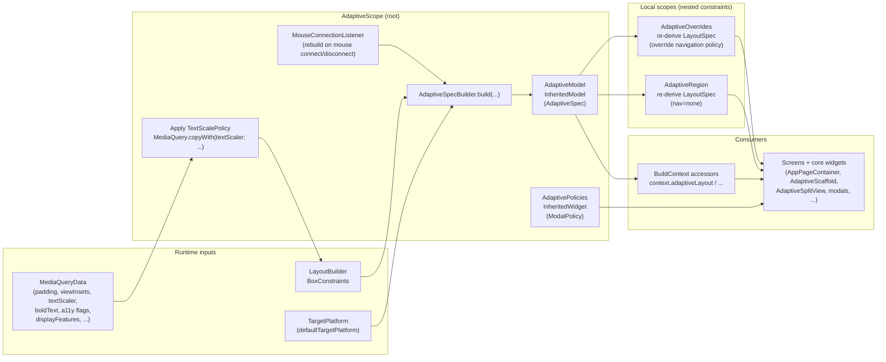

# Under the Hood: How `core/adaptive` Works
**Audience:** engineers extending or debugging the adaptive system  
**Last updated:** 2026-01-14

This explainer focuses on the mechanics: **how signals flow**, **how updates propagate**, and **why the module is structured the way it is**.

---

## 1) The runtime pipeline (from first principles)

At runtime, responsive/adaptive UI comes from only two sources:

1) **Local space**: `BoxConstraints` (what your parent gives you)
2) **Environment/capabilities**: `MediaQueryData` (insets, text scaling, accessibility flags, foldables, etc.)

`AdaptiveScope` turns those raw inputs into a **stable contract** (`AdaptiveSpec`) and publishes it.

Key idea: **features don’t compute “responsive” directly**. They consume the contract.

---

## 2) Why `InheritedModel` + aspects

`AdaptiveScope` uses `InheritedModel<AdaptiveAspect>` (`AdaptiveModel` in `lib/core/design_system/adaptive/adaptive_scope.dart`).

This enables **aspect-scoped rebuilds**:

- `context.adaptiveLayout` depends only on `AdaptiveAspect.layout`
- `context.adaptiveText` depends only on `AdaptiveAspect.text`
- etc.

Under the hood:

- `AdaptiveModel.of(context, aspect: AdaptiveAspect.layout)` registers a dependency on **only** that aspect.
- `AdaptiveModel.updateShouldNotifyDependent(...)` compares the relevant sub-spec (e.g., `spec.layout`) and returns `true` only when it changes.

Result: changing keyboard insets won’t force every layout consumer to rebuild; only insets consumers update.

---

## 3) Contract derivation (`AdaptiveSpecBuilder`)

`AdaptiveSpecBuilder.build(...)` computes:

- `WindowWidthClass` / `WindowHeightClass` from measured size
- `orientation`
- `InputSpec` (via `InputPolicy`)
- `MotionSpec` (via `MotionPolicy`)
- `TextSpec` (via `TextScalePolicy` + `boldText`)
- `InsetsSpec` (safe area + keyboard)
- `FoldableSpec` (from `displayFeatures`)
- `PlatformSpec` (via `PlatformPolicy`)
- `NavigationSpec` (via `NavigationPolicy`)
- `LayoutSpec` (via `deriveLayout(...)` + token tables)

Important constraints rule:

- When constraints are unbounded, size falls back to `media.size`.
- When bounded, **constraints win** (so nested panes can adapt independently).

---

## 4) Text scaling and clamping (modern Flutter)

Flutter’s modern text scaling uses `TextScaler`, not a single linear `textScaleFactor`.

This module applies scaling policy at the root:

- `AdaptiveScope` reads `media.textScaler`
- `TextScalePolicy.apply(...)` returns a scaler (often `incoming.clamp(...)`)
- `AdaptiveScope` installs it via `MediaQuery.copyWith(textScaler: appliedTextScaler)`

Why root-level clamping:

- It affects **all** `Text` widgets automatically.
- It preserves nonlinear scaling behavior on newer OS versions because the scaler object is clamped, not converted to a linear factor.

---

## 5) Nested constraints: `AdaptiveRegion`

`AdaptiveRegion` exists for split views / panes / inspectors where the subtree should adapt to **its own** constraints.

Mechanics:

- It listens to the nearest `AdaptiveModel` (`AdaptiveModel.of(context)`) so non-layout specs stay current.
- It re-derives **only `LayoutSpec`** from local `BoxConstraints`, while inheriting:
  - text/motion/input/platform/foldable/insets from the parent spec
- It forces `NavigationKind.none` inside the region to prevent accidental nested nav scaffolds.

Rule of thumb:

- If a subtree has its own width constraints, wrap it in `AdaptiveRegion` rather than scattering per-screen breakpoints.

---

## 6) Governed escape hatch: `AdaptiveOverrides`

`AdaptiveOverrides` is intentionally narrow and reviewable:

- It **does not reclassify** size classes.
- It re-derives `LayoutSpec` using the existing classification + window size, but with an override (currently: navigation derivation).

This prevents “silent breakpoint forks” while still allowing rare flows to opt out of standard nav patterns.

---

## 7) Modal entrypoints and policy wiring

Modal decisions are centralized via `ModalPolicy`:

- `AdaptiveScope` installs an `AdaptivePolicies` inherited widget with `modalPolicy`
- `showAdaptiveModal` and `showAdaptiveSideSheet` read:
  - current `LayoutSpec` via `context.adaptiveLayout`
  - modal policy via `AdaptivePolicies.of(context).modalPolicy` (or an explicit override parameter)

Outcome: feature code gets consistent behavior without passing decisions around per-call.

---

## 8) Input capability updates (mouse/trackpad)

Pointer capability can change at runtime (mouse/trackpad connect/disconnect).

This module uses:

- `RendererBinding.instance.mouseTracker.mouseIsConnected` inside `InputPolicy`
- a lightweight listener (`_MouseConnectionListener` in `AdaptiveScope`) to trigger rebuilds when the connection changes

Why: not all pointer capability changes reliably flow through `MediaQuery` rebuilds across platforms.

---

## 9) How to debug “why did this layout happen?”

When you’re debugging, inspect these layers in order:

1) Local constraints: is the subtree bounded?
2) Size classes: `context.adaptiveLayout.widthClass` / `heightClass`
3) Tokens: `context.adaptiveLayout.pagePadding`, `gutter`, `surfaceTokens[...]`
4) Policies: navigation/modal/text scaling/motion/input
5) Local scopes: is there an `AdaptiveRegion` / `AdaptiveOverrides` above you?

If you need stronger guarantees over time, extend the golden matrix under `test/core/adaptive/goldens/`.
