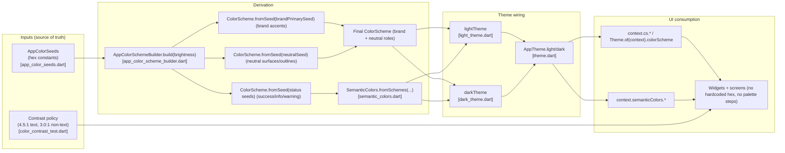

# Under the Hood: How the Color System Works
**Audience:** engineers implementing UI + extending the theme system  
**Last updated:** 2026-01-16

This explainer focuses on the mechanics: **where colors come from**, **how they flow into `ThemeData`**, and **how we enforce accessibility**.

---

## 1) First principles

We treat colors as two layers:

1) **Primitive inputs**: a small set of **seed hex values** (brand + neutral + statuses)
2) **Semantic role outputs**: `ColorScheme` + `SemanticColors` (what UI must use)

We do *not* expose palette-step APIs (palette ramps like `neutral/200`) to UI code. Designers may keep ramps in Figma for exploration, but engineering consumes **roles**.

---

## 2) The runtime pipeline

At runtime, colors are derived once when building the app theme (light/dark) and then consumed everywhere via `Theme.of(context)`.

Key idea: **UI code never talks to seeds or the builder.** UI only consumes the semantic roles published through `ThemeData`.

---

## 3) Why seeds?

Seeds give us:

- **Determinism**: one edit point (`AppColorSeeds`) updates the whole theme consistently.
- **Full coverage**: `ColorScheme.fromSeed` generates a complete scheme (reduces “defaults drift”).
- **Accessibility guardrails**: seeds are validated by tests; we don’t allow random per-widget overrides.

Seeds are *not* about “one color becomes a linear ramp”. Internally, the generator produces a tonal palette and maps tones to roles like `primary`, `onPrimary`, `surface`, etc.

---

## 4) Why a separate neutral seed?

If we generate everything from the brand seed, surfaces can become slightly tinted. In many enterprise apps, that’s undesirable (surfaces should remain neutral to keep content readability + reduce visual noise).

So we build:

- a **brand scheme** for accent roles (`primary`, `secondary`, etc.)
- a **neutral scheme** for surfaces/outlines (`surfaceContainer*`, `outline`, etc.)

We also use the neutral scheme for **neutral elevation**:

- Material 3 applies tonal elevation via `ColorScheme.surfaceTint`.
- We source `surfaceTint` from the **neutral** scheme so elevated surfaces don’t pick up a brand tint.

Then we combine them via `copyWith` in `AppColorSchemeBuilder`.

---

## 5) What to use in widgets

Use roles. Practical mapping:

- Screen background → `context.bgSurface` (`cs.surface`)
- Containers/cards → `context.bgContainer*` (`cs.surfaceContainer*`)
- Primary text → `context.textPrimary` (`cs.onSurface`)
- Secondary text → `context.textSecondary` (`cs.onSurfaceVariant`)
- Control borders → `context.border` (`cs.outline`)
- Decorative separators → `context.borderSubtle` (`cs.outlineVariant`) or `context.hairline`
- Status UI → `context.semanticColors.*`

See the day-to-day cookbook:
- `docs/explainers/core/theme/color_usage_guide.md`

---

## 6) Contrast enforcement (what we guarantee)

We gate contrast with tests so regressions can’t sneak in:

- **Text-bearing pairs** must be **≥ 4.5:1** (WCAG AA normal text)
- **Control boundaries** must be **≥ 3.0:1** against adjacent surfaces (WCAG 1.4.11 non-text)

Enforced in:
- `test/core/theme/color_contrast_test.dart`

Run locally:
- `tool/agent/flutterw --no-stdin test test/core/theme/color_contrast_test.dart`

---

## 7) How to change colors safely

1) Update seeds in `lib/core/theme/system/app_color_seeds.dart`
2) Run:
   - `tool/agent/flutterw --no-stdin analyze`
   - `tool/agent/flutterw --no-stdin test test/core/theme/color_contrast_test.dart`
3) If contrast fails, fix it by adjusting seeds (or add a controlled override in the builder), not by tweaking widget colors.

---

## 8) Relationship to Figma “100/200/300” ramps

Design can keep palette ramps as **primitives**, but handoff to engineering must be **semantic roles**.

Translation rule:
- If a design calls out `neutral/200`, ask: *what is it used for?*
  - background, border, divider, text, disabled state, etc.
- Map that intent to a role (`surface`, `outline`, `onSurfaceVariant`, …).

This is how you keep UI consistent across screens while remaining flexible as the design evolves.
